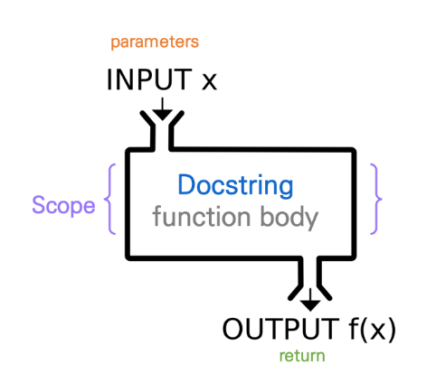
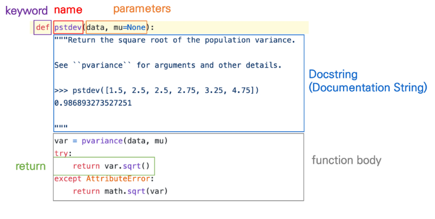

# Python

## 함수 인트로

### 함수

- 함수를 왜 사용할까요?
  
  - Decomposition(분해) : 기능을 분해하고 재사용 가능하게 만들고 간결하고, 이해하기 쉽다
  
  - Abstraction(추상화) : 복잡한 내용을 모르더라도 사용할 수 있도록(스마트폰) 재사용성과 가독성, 생산성

## 함수 기초

### 함수의 종류

- 함수는 크게 3가지로 분류
  
  - 내장 함수 : 파이썬에 기본적으로 포함된 함수 예) print, sum ,,,
  
  - 외장 함수 : import문을 통해 사용하며, 외부 라이브러리에서 제공하는 함수
  
  - 사용자 정의 함수 : 직접 사용자가 만드는 함수   

### 함수의 정의

- 함수(Funcion)
  
  - 특정한 기능을 하는 코드의 조각(묶음)
  
  - 특정 코드를 매번 다시 작성하지 않고, 필요시에만 호출하여 간편히 사용
  
  

### 함수 기본 구조

- 선언과 호출

- 입력

- 문서화

- ~~범위~~

- 결과값

### 함수 기본 구조

parameters / argument 헷갈리지말장 

### 선언과 호출(define & call)

- 함수의 선언은 def 키워드 활용

- 들여쓰기를 통해 Function body(실행될 코드 블록)를 작성
  
  - Docstring은함수 body앞에 선택적으로 작성 가능

- 함수는 parameter를 넘겨줄 수 있음

- 함수 동작 후에 return을 통해 결과값을 전달함

### 함수의 정의

## 함수의 결과값

### 값에 따른 함수의 종류

- Void function : 명시적인 return 값이 없는 경우, None을 반환하고 종료

- Value returning  function
  
  - 함수 실행 후, return문을 통해 값 반환
  
  - <u>return을 하게 되면, 값 반환 후 함수가 바로 종료</u>

### 주의 - print vs return

- print 함수와 return의 차이점
  
  - print를 사용하면호출될 때마다 값이 출력됨(주로 테스트)
  
  - 데이터 처리를 위해선 return을 사용

- REPL

### 두 개 이상의 값 변환

## 함수의 입력(input)

### Parameter 와 Argument

- parameter  : 함수를 정의할 때, 함수 내부에서 사용되는 <mark>변수</mark> : 처음 함수를 정의할 때, 만들어 넣는 변수

- Argument : 함수를 호출 할때, 넣어주는 값 : 함수한테 전달
  
      Prsitional Arguments
  
  예) ham (parameter) = 'spam' (argument)

- 기본적으로 함수 호출 시 Argument라는위치에 따라 함수 내에 전달됨

### Argument

- Argument 란?
  
  - 함수 호출 시 함수의 parameter를 통해 전달되는 값
  
  - Argument는 소괄호 안에 할당 func_namte(argument)
    
    - 필수 Argument : 반드시 전달되어야 하는 argument
    
    - 선택 Argument : 값을 전달하지 않아도 되는 경우는 기본값이 전달

### keyword Arguments

- 직접 변수의 이름으로 특정 Argument를 전달할 수 있음

- Keyword Argument 다음에 positional Argument를 활용할 수 없음

### Default Arguments Values

- 기본값을 지정하여 함수 호출 시 argument 값을 설정하지 않도록 함
  
  - 정의된 것 보다 더 적은 개수의 argument 들로 호출될 수 있음

## 함수의 결과값(output)

### 주의 - print vs return

- print 함수와 return의 차이점
  
  - print를 사용하면 호출될 때마다 값이 <u>출력</u>됨 (테스트를 위해 사용)
  
  - 데이터 처리를 위해서는 return 사용

- REPL 환경에서는 마지막으로 작성된 코드의 리턴값을 보여주므로 같은 동작을 하는 것으로 착각할 수 있음
  
  - return은 Out과 함께 나옴

### 두개 이상의 값 반환

하나의 값만 반환

### 튜플을 활용하여 두 개 이상의 값 반환

반환 값으로 튜플 사용 (dict, set, list 안됨!)

### 함수 반환 정리

- return X => None

- return O => 하나를 반환 => 여러개를 원하면, 튜플 활용

- 

## Python

### Python의 범위(Scope)

- 함수는 코드 내부에 local scope를 생성하며, 그 외의 공간인 global scope로 구분

- scope
  
  - global scope : 코드 어디에서든 참조할 수 있는 공간
  
  - local scope : 함수가 만든 scope. 함수 내부에서만 참조 가능

- variable
  
  - global variable : global scope에 정의된 변수
  
  - local variable : local scope에 정의된 변수

'* name space : 식별자들을 기억하는 공간 : 같은이름이 가능하다 (여러 곳에 존재 가능)

찾는 순서 : LEGB

biult in 

global

enclosed

local

기억 안나도 locals() :  로 출력하면 알수있음

#### 예시2

300 이유 **

### 변수 수명주기

- 변수는 각자의 수명주기(lifecycle)

### 함수 범위 주의

- 기본적으로 함수에서 선언된 변수는 Local scope에 생성되며, 함수 종료 시 사라짐

- 해당 scope에 변수가 없는 경우 LEGB rule에 의해 이름을 검색함
  
  - 변수에 접근은 가능하지만, 해당 변수를 수정할 수는 없음
  
  - 값을 할당하는 경우 해당 scope의 이름 공간에 새롭게 생성되기 때문
  
  - <mark>단, 함수 내에서 필요한 상위 scope 변수는 argument로 넘겨서 활용할 것</mark>

- 상위 scope에 있는 변수를 수정하고 싶다면 global, nonlocal 키워드를 활용 가능
  
  - 단, 코드가 복잡해지면서 변수의 변경을 추적하기 어렵고, 예기치 못한 오류가 발생
  
  - 가급적 사용하지 않는 것을 권장하며, 함수로 값을 바꾸고자 한다면 항상 argument로 넘기고 리턴 값을 사용하는 것을 추천

## 세트 { } , 순서 보장 X

시퀀스, 비시퀀스 차이 : 순서 보장 : srt, list / dict, set
