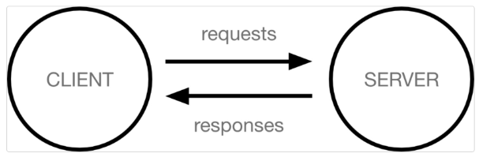

# 0314

### Framework 이해하기

- 누군가 만들어 놓은 코드를 재사용 하는 것은 이미 익숙한 개발 문화

- 누군가 개발해 놓은 코드 재사용

- 코드들을 모아 놓은것, 즉 **서비스 개발에 필요한 기능들을 미리 구현해서 모아 놓은 것 = 프레임워크(Framework)**
  
  - 장점 : 개발속도가 빨라짐, 검증된 코드 사용, 반복을 줄임, 협엽에 용이
  
  - 단점 : 선택의 폭이 좁음, <mark>러닝커브</mark>(학습)

- Frame(뼈대, 틀) + work(일하다)
  
  - 일정한 뼈대, 틀을 가지고 일하다.
  
  - 제공받은 도구들과 뼈대, 규약을 가지고 무언가를 만드는 일
  
  - 특정 프로그램을 개발하기 위한 여러 도구들과 규약을 제공하는 것

- "소프트웨어 프레임워크"는 복잡한 문제를 해결하거나 서술하는데 사용되는 기본 개념 구조

- Framework를 잘 사용하기만 하면 웹 서비스 개발에 있어서 모든 것을 직접 개발할 필요 없이, 본질(로직)에 집중해 개발 할 수 있음

- 소프트웨어의 생산성과 품질을 높임

### Django를 배워야 하는 이유

1. python 으로 작성된 프레임워크
   
   - python 이라는 언어의 강력함과 거대한 커뮤니티

2. 수많은 여러 유용한 기능들

3. 검증된 웹 프레임워크
   
   - 인스타그램(전), 화해, Toss, 두나무, 당근마켓, 요기요 등
   
   - 유명한 많은 회사들이 서비스 사용 == <u>안정적으로 서비스</u>를 할 수 있다는 검증

## 클라이언트와 서버

### 클라이언트-서버 구조

- 오늘날 우리가 사용하는 대부분의 웹 서비스는 클아이언트-서버 구조를 기반으로 동작

- **클라이언트**와 **서버** 역시 하나의 컴퓨터이며 이들이 어떻게 상오작용하는지에 대한 간소화된 다이어그램은 다음와 같음

            

            1. requsts 

            2. server, reponses

            3. client

- 클라이언트
  
  - 웹 사용자의 인터넷에 연결된 장치 (예 : wi-fi에 연결된 컴퓨터 또는 모바일)
  
  - Chrome 또는 Firefox와 같은 웹 브라우저
  
  - 서비스를 요청하는 주체

- 서버
  
  - ~~웹페이지, 사이트 또는 앱을 저장하는 컴퓨터~~
  
  - 클라이언트가 웹 페이지에 접근하려고 할 때 서버에서 클라이언트 컴퓨터로 웹 페이지 데이터를 응답해 사용자의 웹 브라우저에 표시됨
  
  - ** 요청에 대한 서비스를 응답하는 주체

### 클라이언트-서버 구조

- 상호작용 예시
  
  : 예를 들어 우리가 Google 홈페이지에 접속한다는 것은 무엇을 뜻
  
  1. 결론적으로 인터넷에 연결된 전세계 어딘가에 있는 구글 컴퓨터에세 'Google 홈페이지.html'파일을 달라고 요청하는 것
  
  2. 그러면 구글 컴퓨터는 우리의 요청을 받고 'Google 홈페이지.html'파일을 인터넷을 통해서 우리 컴퓨터에게 응답
  
  3. 전달받은 Google 홈페이지.html 파일을 웹 브라우저가 우리가 볼 수 있도록 해석해주는 것

### 정리

- 우리가 사용하는 웹은 클라이언트-서버 구조로 이루어져 있음

- 앞으로 우리가 배우는 것도 이 <u>클라이언트-서버 구조를 만드는 방법</u>을 배우는 것

- 이 중에서 Django는 서버를 구현하는 웹 프레임워크

### ------

Client ----request>>  <<reponse: .html----->Server(Django) <-------->DB

## Django 무작정 따라하기

### 공식문서

https://docs.djangoproject.com/ko/4.1/intro/

### Django Project

- 프로젝트 생성 : django-admin startproject firstpjt

- 서버 실행 : python manage.py runserver

## 가상환경

### 패키지와 가상환경

외부 패키지 사용 가능

### 가상환경 사용하기

- 가상환경 생성 : python  -m venv venv

- 가상환경 활성화 : source venv/Scripts/activate

- 가상환경 비활성화 : deactivate

### 가상환경 사용하기

- 가상환경 : 프로젝트별 패키지를 독립적으로 관리하기 위한것

- 내 프로젝터를 다른사람이 실행하려면 모든 패키지 설치 다시해야함

- 가상환경 패키지 목록 저장 : pip freeze > requirements.txt

- 파일로부터 패키지 설치 : pip install -r requirements.txt

### Django 만들기

## 프로젝트와 앱

### 프로젝트 구조

- ** settings.py : django 프로젝트 설정을 관리

- ** urls.py : 사이트의 url과 적절한 views의 연결을 지정

- manage.py : django 프로젝트와 다양한 방법으로 상호작용하는 커맨드라인 유틸리티

### Django Application

- 애플리케이션(앱) 생성

        $ python manage.py startapp articles

    일반적으로 애플리케이션 이름은 '복수형'으로 작성하는 것을 권장

앱(App) == 하나의 큰 기능 단위

정해진 규칙은 없으며 개발자가  판단해서 앱 생성

여러 개의 앱이 아닌 단일 앱으로 개발해도 괜찮음

### 애플리케이션 구조

- admin.py : 관리자용 페이지를 설정 하는 곳

- ** models.py : 애플리케이션에서 사용하는 Model을 정의하는 곳, MTV 패턴의 M에 해당

- views.py : view 함수들이 정의 되는 곳, MTV 패턴의 V에 해당

### 애플리케이션 등록 ****

- 앱을 사용하기 위해서는 반드시 INSTALLED_APPS 리스트에 반드시 추가해야 함

## 요청과 응답

### 들어가기전에

Django의 세가지 구조

- Mode : data 관련

- View : 로직 관련

- Template : 보여지는 것, .html

=>  MTV 구조

### URLs

: URL -> View -> Template 데이터 흐름 이해하기
