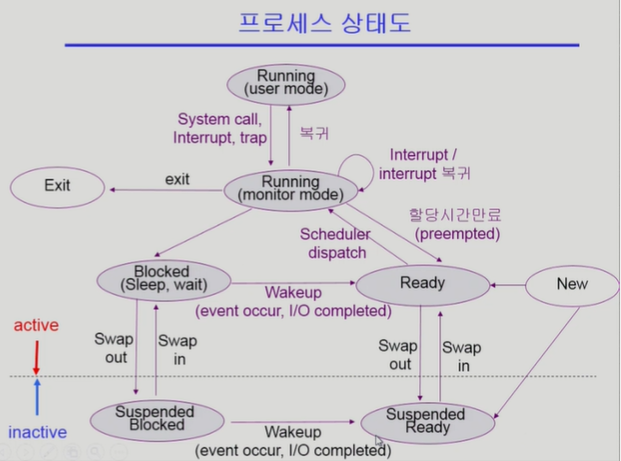
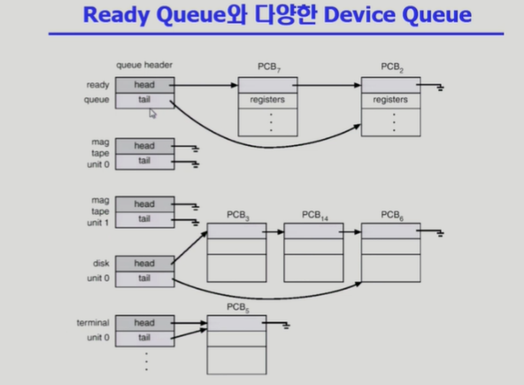
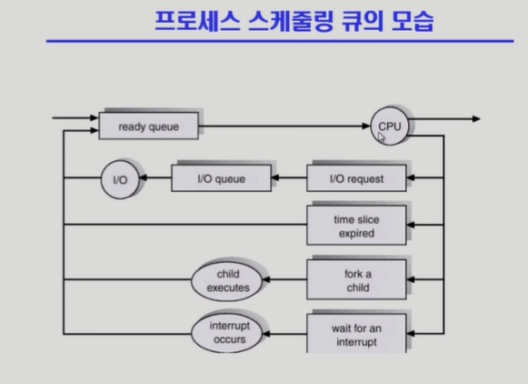
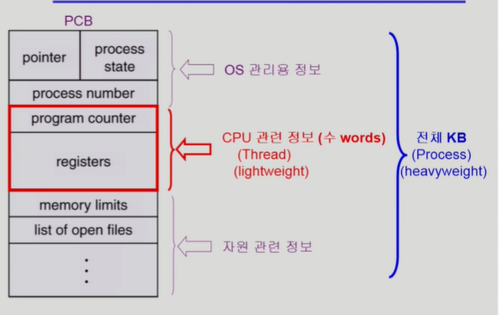
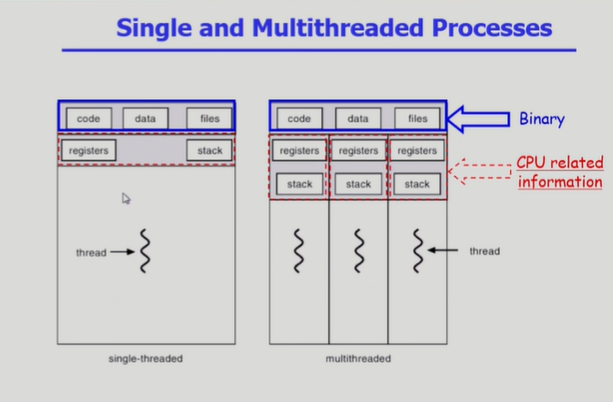
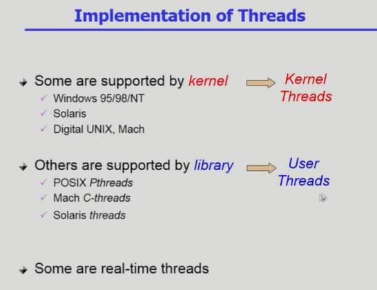

# Chapter 3. Process

### 프로세스의 개념

- "Process is a program in execution"

- 프로세스의 문맥(context)
  
  - CPU 수행 상태를 나타내는 하드웨어 문맥
    
    - Program Counter
    
    - 각종 register
  
  - 프로세스의 주소 공간
    
    - code, data, stack
  
  - 프로세스 관련 커널 자료 구조
    
    - PCB(Process Control Block)
    
    - Kernel stack

### 프로세스의 상태

- 프로세스는 상태(state)가 변경되며 수행된다.
  
  - Running 
    
    - CPU를 잡고 instruction을 수행중인 상태
  
  - Ready
    
    - CPU를 기다리는 상태(메모리 등 다른 조건을 모두 만족하고)
  
  - Bolcked (wait, sleep)
    
    - CPU를 주어도 당장 instruction을 수행할 수 없는 상태
    
    - Process 자신이 요청한 event(예:I/O)가 즉시 만족되지 않아 이를 기다리는 상태
    
    - 예) 디스크에서 file을 읽어 와야하는 경구
  
  - Suspended (stopped)
    
    - 외부적인 이유로 프로세스의 수행이 정지된 상태
    
    - 프로세스는 통째로 디스크에 swap out 된다
    
    - 예) 사용자가 프로그램을 일시정지 시킨 경우(break key) 시스템이 여러 이유로 프로세스를 잠시 중단시킴(메모리에 너무 많은 프로세스가 올라와 있을때)

    ** New : 프로세스가 생성중인 상태

    ** Terminated : 수행(execution)이 끝난 상태

    ** Blocek : 자신이 요청한 event가 만족되면 Ready

    ** Suspended : 외부에서 resume해 주어야 Active

### 프로세스 상태도

### 프로세스의 상태

### Process Control Block (PCB)

- PCB
  
  - 운영체제가 각 프로세스를 관리하기 위해 프로세스당 유지하는 정보
  
  - 다음의 구성 요소를 가진다(구조체로 유지)
    
    1. OS가 관리상 사용하는 정보
       
       - Process state, Process ID
       
       - scheduling information, priority
    
    2. CPU 수행 관련 하드웨어 값
       
       - Program counter, registers
    
    3. 메모리 관련
       
       - Code, data, stack의 위치 정보
    
    4. 파일 관련
       
       - Open file descriptors...

### 문맥 교환(Context Swith)

- CPU를 한 프로세스에서 다른 프로세스로 넘겨주는 과정

- CPU가 다른 프로세스에게 넘어갈 때 운영체제는 다음을 수행
  
  - CPU를 내어주는 프로세스의 상태를 그 프로세스의 PCB에 저장
  
  - CPU를 새롶게 얻는 프로세스의 상태를 PCB에서 읽어옴

### 문맥 교환(Context Switch)

- System call 이나 Interrupt 발생시 반드시 context switch가 일어나는 것은 아님

### 프로세스를 스케줄링하기 위한 큐

- Job queue
  
  - 현재 시스템 내에 있는 모든 프로세스의 집합

- Ready queue
  
  - 현재 메모리 내에 있으면서 CPU를 잡아서 실행되기를 기다리는 프로세스의 집합

- Device queues
  
  - I/O device의 처리를 기다리는 프로세스의 집합

- 프로세스들은 각 큐들을 오가며 수행된다

### Ready Queue와 다양한 Device Queue

### 프로세스 스케줄링 큐의 모습

 섞여잇는 이야기임!

### 스케줄러 (Scheduler)

- Long_term scheduler(장기 스케쥴러 or job scheduler)
  
  - 시작 프로세스 중 어떤 것들을 ready queue로 보낼지 결정
  
  - 프로세스에 memory(및 각종 자원)을 주는 문제
  
  - degree of Multiprogramiing을 제어
  
  - time sharing system에는 보통 장기 스테줄러가 없음(무조건 ready)

- Short-term scheduler(단기 스케줄러 of CPU scheduler)
  
  - 어떤 프로세스를 다음번에 running 시킬지 결정
  
  - 프로세스에 CPU를 주는 문제
  
  - 충분히 빨라야 함(millisecond 단위)

- Medium-Term Scheduler(중기 스케줄러 of Swapper)
  
  - 여유 공간 마련을 위해 프로세스를 통째로 메모리에서 디스크로 쫓아냄
  
  - 프로세스에게서 memory를 뺏는 문제
  
  - degree of Multiprogramming을 제어

### Thread

- "A thread(or lightweight process)is a basci unit of CPU stilization"

- 프로세스 하나에 CPU 수행 단위만 여러개를 두고 있는 것

- Thread의 구성
  
  - program counter
  
  - register set
  
  - stack space

- Thread가 동료 thread와 공유하는 부분(=task)
  
  - code section
  
  - data section
  
  - OS resources

- 전통적인 개념 heavyweight process는 하나의 thread를 가지고 있는 task로 볼 수 있다

- 다중 스레드로 구성된 태스크 구조에서는 하나의 서버 스레드가 blocked (wating) 상태인 동안 동일한 태스크 내의 다른 스레드가 실행(running)되어 빠른 처리를 할 수 있다.

- 동일한 일을 수행하는 다중 스레드가 협력하여 높은 처리율(throughput)과 성능 향상을 얻을 수 있다.

- 스레드를 사용하면 병령성을 높일 수 있다.

### Single and Multithreaded processes

### 스레드의 장점

