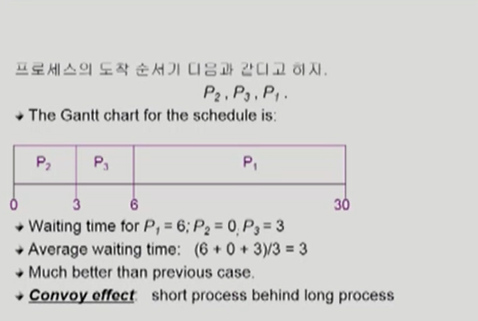
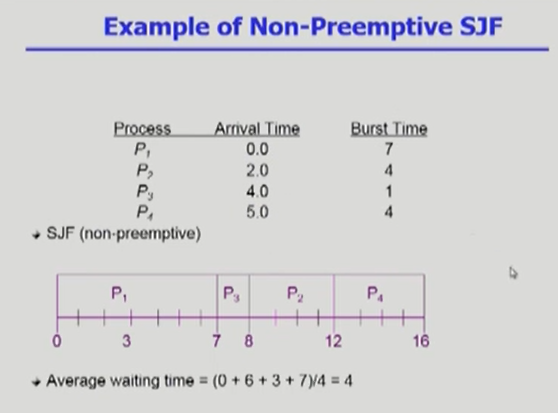
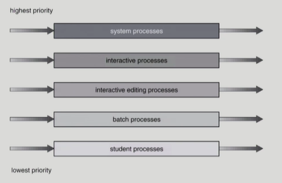
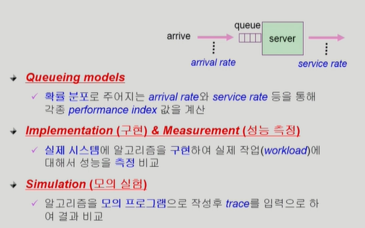

# 0201

## Chapter 5. CPU Scheduling

### CPU and I/O Bursts in Program Execution

### CPU - burst Time의 분포

** 여러 종류의 job(=process)이 섞여 있기 때문에 CPU 스케줄링이 필요하다

- Interactive job에게 적절한 response 제공 요망

- CPU와 I/O 장치 등 시스템 자원을 골고루 효율적으로 사용

### CPU Scheduler & Dispatcher

- CPU Scheduler
  
  - Ready 상태의 프로세스 중에서 이번에 CPU를 줄 프로세스를 고른다

- Dispatcher
  
  - CPU의 제어권을 CPU scheduler에 의해 선택된 프로세스에게 넘긴다
  
  - 이 과정을 context switch(문맥교환)라고 한다.

- CPU 스케줄링이 필요한 경우는 프로세스에게 다음과 같은 상태 변화가 있는 경우이다.
  
  1. Running -> Bloced (예: I/O 요청하는 시스템 콜)
  
  2. Running -> Ready (예 : 할당시간마료로 timer interrupt)
  
  3. Blocked -> Ready (예 : I/O 완료후 인터럽트)
  
  4. Terminate

** 1,4에서의 스케줄링은 nonpreemptive(=강제로 빼앗지 않고 자진 반납) : 비선정형

** All other schedulling is preemptive (=강제로 빼앗음) : 선정형

### Scheduling Criteria

: Performance Index (= Performance Measure, 성능, 척도)

- CPU utilization (이용률)
  
  - keep the CPU as busy as possible

- Throughput(처리량)
  
  - of processes that complete their execution per time unit

-  Turnaround time( 소요시간, 반환시간)
  
  - anount of time to execute a particular process

- Waiting time(대기 시간)
  
  - amount of time a process has been waiting in the ready queue

- Response time(응답시간)
  
  - amount of time it takes from when a request was submitted untill the first response is produced, not output(for time-sharing environment)

wait 타임이랑 response 시간 차이점?

### Scheduling Algorithms

- FCFS(First-Come First_Served)

- SJF(Shortest-Job-First)

- SRTF(Shrtest-Romaining-Time_First)

- Priority Scheduling

- RR (Round Robin)

- Multilevel Queue

- Multilevel Feedback Queue

### FCFS(First-Come First_Served)

  

### SJF (Shortest-Job-First)

- 각 프로세스와 다음번 CPU burst time을 가지고 스케줄링에 활용

- CPU burst time이 가장 짧은 프로세스를 제일 먼저 스케줄

- Two schemes:
  
  - Nonpreemptive
    
    - 일단 CPU를 잡으면 이번 CPU burst가 완료될때까지 CPU를 설정(preemption) 당하지 않음
  
  - Preemptive
    
    - 현재 수행중인 프로세스의 남은 burst time 보다 더 짧은 CPU burst time을 가지는 새로운 프로세스가 도착하면 CPU를 빼앗김
    
    - 이 방법을 Shortest-Remaining-Time-First(SRTF)이라고 부름
  
  - SJF is optimal
    
    - 주어진 프로세스들에 대해 minimum average waiting time을 보장

예 :

### 다음 CPU Burst Time의 예측

### Exponential Averaging

### Priority Scheduling

- A priorty number (integer) is associated with each process

- highest priority를 가진 프로세스에세 CPU를 할당(smallist integer = highest priority)
  
  - Preemptive
  
  - nonpreemptive

- SJF는 일종의 priority scheduling이다
  
  - priority = predicted next CPU burst time

- Problem
  
  - Sravation(기아 현상) : low priority processes may never execute

- Soultion
  
  - Aging(노화) :  as time progresses incresase the priority of the process

### RR (Round Robin)

- 각 프로세스는 동일한 크기의 할당 시간(time quantum)을 가짐 (일반적으로 10-100 milliseconds)

- 할당 시간이 지나면 프로세스는 선점(preempted)당하고 ready queue의 제일 뒤에 가서 다시 줄을 선다

- n개의 프로세스가 ready queue에 있고 할당 시간이 q time unit인 경우 각 프로세스는 최대 q time unit 단위로 CPU 시간의 1/n 을 얻는다.

        => 어떤 프로세스도 (n-1)q time unit 이상 기다리지 않는다.

- Performance
  
  - q large => FCFS
  
  - q small => context swith 오버헤드가 커진다
  
  

### Multilevel Queue

- Ready queue를 여러 개로 분할
  
  - foreground(Interactive)
  
  - background(bath - no human interaction)

- 각 큐는 독립적인 스케줄링 알고리즘을 가짐
  
  - foreground - RR
  
  - background - FCFS

- 큐에 대한 스케줄링이 필요
  
  - Fixed priority scheduling
    
    - serve all from foreground then from baackground
    
    - Possibility of starvation
  
  - Time slice
    
    - 각 큐에 CPU time을 적절한 비율로 할당
    
    - Eg., 80% to foreground in RR, 20% to background in FCFS

### Multilevel Feedback Queue

- 프로세스가 다른 큐로 이동 가능

- 에이징(aging)을 이와 같은 방식으로 구현할 수 있다.

- Multilevel - feedback - queue scheduler를 정의하는 파라미터들ㄷ
  
  - Queue의 수 
  
  - 각 큐의 scheduling algorithm
  
  - Process를 상위 큐로 보내는 기준
  
  - Process를 하위 큐로 내쫓는 기준
  
  - 프로세스각 CPU 서비스를 받으려 할 때 들어갈 큐를 결정하는 기준

### Multiple - Processor Scheduling

- CPU가 여러 개인 경우 스케줄링은 더욱 북잡해짐

- Homogeneous processor인 경우
  
  - Queue에 한줄로 세워서 각 프로세서가 알아서 꺼내가게 할 수 있다
  
  - 반드시 특정 프로세서에서 수행되어야 하는 프로세서가 있는 경우에는 문제가 더 복잡해짐

- Load sharing
  
  - 일부 프로세서에 job이 몰리지 않도록 부하를 적절히 공유하는 메커니즘 필요
  
  - 별개의 큐를 두는 방법 vs 공동 큐를 사용하는 방법

- Symmetric Multiprocessing (SMP)
  
  - 각 프로세서가 각자 알아서 스케줄링 결정

- Asymmetric multiprocessing
  
  - 하나의 프로세서가 시스템 데이터의 접근과 공유를 책임지고 나머지 프로세서는 거기에 따음

### Real-Time Scheduling

- Hard real-time systems
  
  - Hard real-time task는 정해진 시간 안에 반드시 끝내도록 스케줄링 해야함

- Soft real-time computing
  
  - Soft real-time task는 일반 프로세스에 비해 높은 priority를 갖도록 해야 함

- Local Scheduling
  
  - User level thread의 경우 사용자 수준의 thread library에 의해 어떤 thread를 스케줄 할지 결정

- Global Scheduling
  
  - Kernel level thread의 경우 일반 프로세스와 마찬 가지로 커널의 단기 스케줄러가 어떤 thread를 스케줄할지 결정 

### Algorithm Evaluation

