## N:1 (Comment-User)

### 개요

- Comment(N) - User(1)

- Comment 모델과 User 모델 간 관계 설정

- "0개 이상의 댓글은 1개의 회원에 의해 작성 될 수 있음"

## 모델 관계 설정

### Comment 와 User간 모델 관계 설정

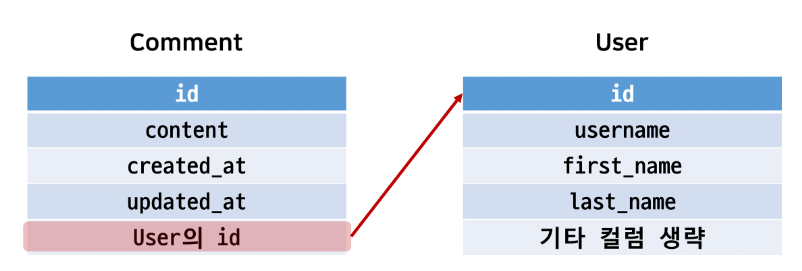

- Comment 모델에 User 모델을 참조하는 외래 키 작성

```python
# articles/models.py

class Comment(models.Model):
    article = models.ForeignKey(Article, on_delete=models.CASCADE)
    user = models.ForeignKey(settings.AUTH_USER_MODEL, on_delete=models.CASCADE)
```

### Migration 진행

- 이전에 User와 Article 모델 관계 설정때와 마찬가지로 기존에 존재하던 테이블에 새로운 컬럼이 추가 되어야하는 상황이기 때문에 migrations 파일이 곧바로 만들어지지 않고 일련의 과정이 필요

```bash
$ python manage.py makemigrations
```

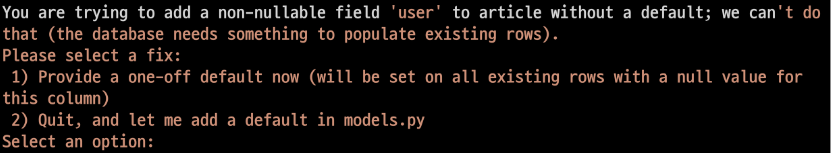

- 첫번째 화면
  
  - 기본적으로 모든 컬럼은 NOT NULL 제약 조건이 있기 때문에 데이터가 없이는 새로 추가되는 외래 키필드 user_id 가 생성되지 않음
  
  - 그래서 기본 값을 어떻게 작성할 것인지 선택
  
  - => 1 입력

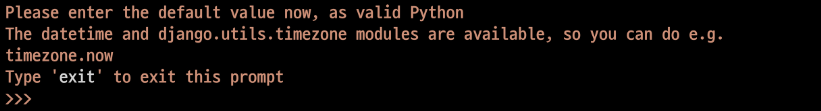

- 두번째 화면
  
  - comment의 user_id에어떤 데이터를 넣을 것인지 직접 입력해야함
  
  - => 1 입력
  
  - 기존에 작성된 댓글이 있다면 모두 1번 회원이 작성한 것으로 처리

- migrate 진행
  
  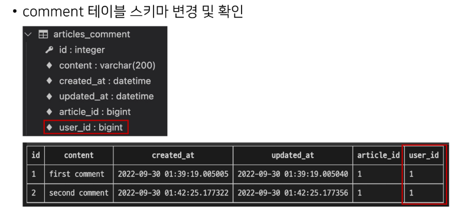

## 구현

## CREATE

## 개요

- 인증된 회원의 댓글 작성 구현하기

- 작성하기 전 로그인을 먼저 진행한 상태로 진행

### CommentForm

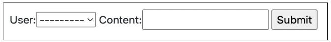

- CommentForm 출력을 확인해보면 create 템플릿에서 불필요한 필드(user)가 출력

- user 필드에 작성해야 하는 user 객체는 view 함수의 request 객체를 활용해야 함

- CommentForm의 출력 필드 수정

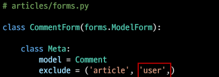

### 외래 키 데이터 누락

- 댓글 작성시 NOT NULL -- 에러 발생

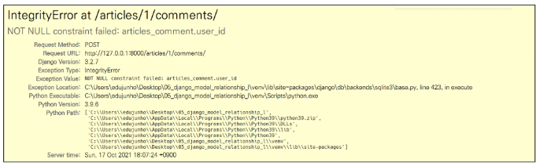

- 댓글 작성 시 외래 키에 저장되어야할 작성자 정보가 누락

- 댓글 작성 시 작성자 정보가 함께 저장될 수 있도록 save 의 commit 옵션을 활용

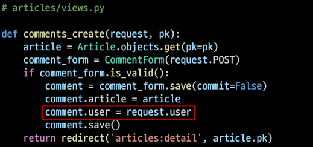

## READ

### 댓글 작성자 출력

- detail 템플릿에서 각 게시글의 작성자 출력

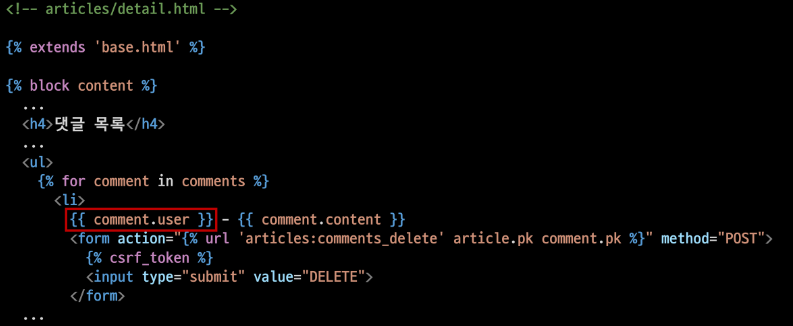

### DELETE

### 댓글 삭제 시 작성자 확인

- 이제 댓글에는 작성자 정보가 함께 들어있기 때문에 현재 삭제를 요청하려는 사람과 댓글을 작성한 사람을 비교하여 본인의 댓글만 삭제 할 수 있도록 함

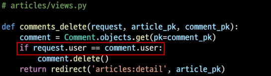

- 해당 댓글의 작성자가 아니라면, 삭제 버튼 출력 X

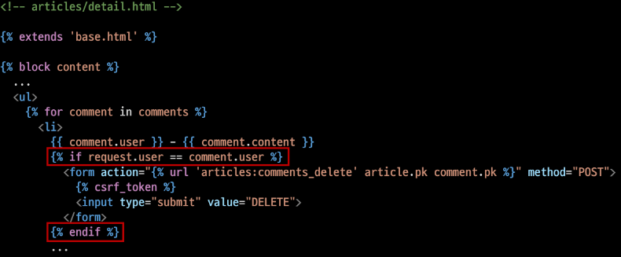

## 인증된 사용자에 대한 접근 제한하기

### 개요

- is_authenticated와 View decorator를 활용하여 코드 정리

### 인증된 사용자인 경우에만 댓글 작성 및 삭제

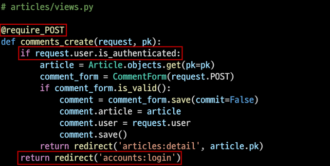

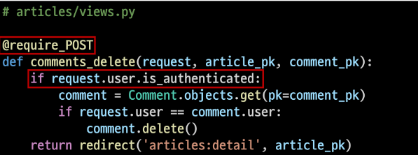

### 비인증 사용자는 CommentForm을 볼 수 없도록 하기

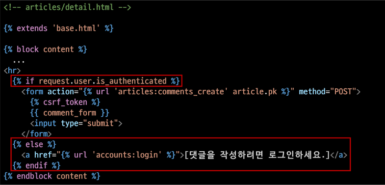

## ManyToManyField란

- ManyToManyField(to, **options)

- 다대다 관계 설정 시 사용하는 모델 필드

- 하나의 필수 위치인자가 필요

- 모델 필드의 RelatedManager를 사용하여 관련 개체를 추가, 제거 또는 만들 수 있음
  
  - add(), remove(), create(), clear()

### 데이터베이스에서의 표현

- django는 다대다 관계를 나타내는 중개 테이블을 만듦

- 테이블 이름은 ManyToManyField 이름과 이를 포함하는 모델의 테이블 이름을 조합하여 생성됨

- 'db_table' arguments을 사용하여 중개 테이블의 이름을 변경할 수도 있음

### ManyToManyField's Arguments

1. related_name
   
   - target model이 source model을 참조할 때 사용할 manager name
   
   - Foreignkey의 related_name과 동일

2. through
   
   - 중개 테이블을 직접 작성하는 경우, through 옵션을 사용하여 중개 테이블을 나타내는 Django 모델을 지정
   - 일반적으로 중개 테이블에 추가 데이터를 사용하는 다대다 관계와 연결하려는 경우에 사용됨

3. symeetrical
   
   - 기본 값 : True
   
   - ManyToManyField가 동일한 모델(on self)을 가리키는 정의에서만 사용
   
   - 예시
   
   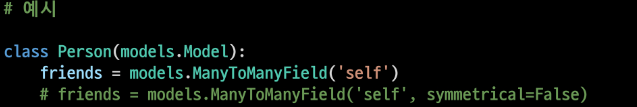
   
   - True일 경우
     
     - _set 매니저를 추가 하지 않음
     
     - source 모델의 인스턴스가 target 모델의 인스턴스를 참조하면 자동으로 target 모델 인스턴스도 source 모델 인스턴스를 자동으로 참조하도록 함(대칭)
     
     - 내가 팔로우하면 상대도 나를 팔로우
   
   - 대칭을 원하지 않을때 : False (Follow 기능 구현에서 다시 확인)

### Related Manager

- N:1 혹은 M:N 관계에서 사용 가능한 문맥 (context)

- Django는 모델 간 N:1 혹은 M:N 관계가 설정되면 역참조시에 사용할 수 있는 manager을 생성

- 같은 이름의 메서드여도 각 관계(일대다, 다대다)에 따라 다르게 사용 및 동작
  
  - N:1 에서는 target 모델 객체만 사용 가능
  
  - M:N 관계에서는 관련된 두 객체에서 모두 사용 가능

- 메서드 종류
  
  - add(), remove(), create(),clear(), set() 등

### methods ** many-to-may relationships

- add()
  
  - "지정된 객체를 관련 객체 집합에 추가"
  
  - 이미 존재하는 관계에 사용하면 관계가 복제 되지 않음
  
  - 모델 인스턴스 , 필드 값(PK)을 인자로 허용

- remove()
  
  - "관련 객체 집합에서 지정된 모델 개체를 제거"
  
  - 내부적으로 QuerySet.delete()를 사용하여 관계가 삭제됨
  
  - 모델 인슽ㄴ스, 필드 값(PK)을 인자로 허용

## M:N (Article-User)

### 개요

- Article과 User의 M:N 관계 설정을 통한 좋아요 기능 구현

## LIKE

### 모델 관계 설정

- ManyToManyField 작성

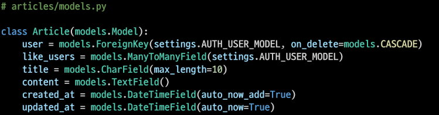


놀라지말도록 그런데 왜 migrations 하지도 않았는데 뜨지?

- migration 진행 후 에러 확인

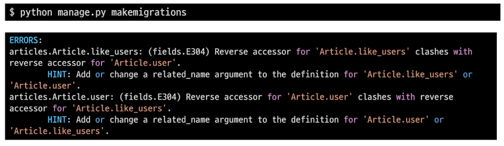

- like_users 필드 생성 시 자동으로 역참조에는 .article_set 매니저가 생성됨

- 그러나 이전 N:1 (Article-User) 관계에서 이미 해당 매니저를 사용 중
  
  - user.article_set.all() -> 해당 유저가 작성한 모든 게시글 조회
  
  - user가 작성한 글들(user.article_set)과 user가 좋아요 누른 글(user.article_set)을 구분할 수 없게 됨

- user와 관계된 ForeignKey 혹은 ManyToManyField 중 하나에 related_name을 작성해야 함

- ManyToManyField에 related_name 작성 후 Migration

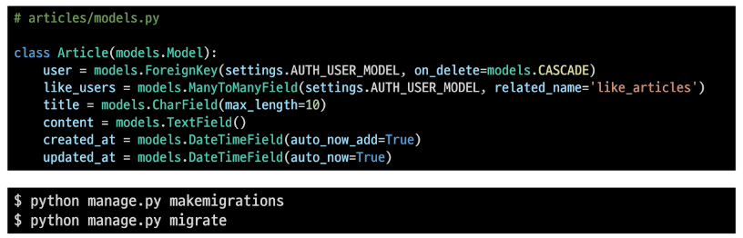

- User_Article 간 사용 가능 한 related manager 정리
  
  - article.user : 게시글을 작성한 유저 - N:1 
  
  - user.article_set : 유저가 작성한 게시글(역참조) - N:1
  
  - article.like_users : 게시글을 좋아요한 유저 - M:N
  
  - user.like_articles : 유저가 좋아요한 게시글(역참조) - M:N

### LIKE 구현

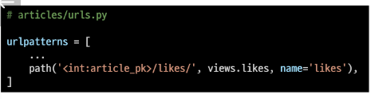

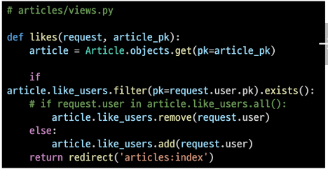

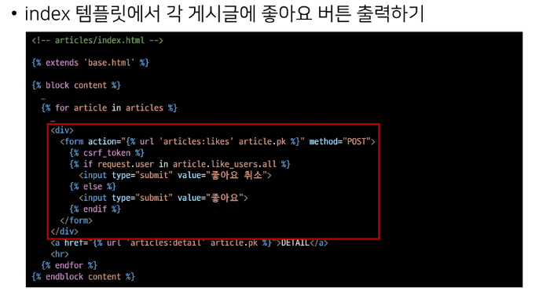

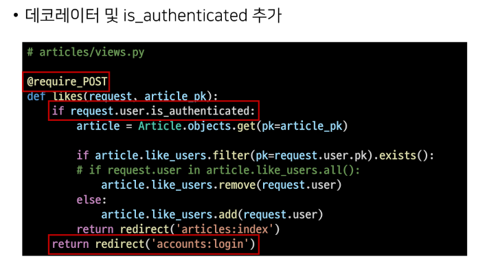

### .exists()

- QuerySet 에 결과가 포함되어 있으면 True를 반환하고 그렇지 않으면 False를 반환

- 특히 큰 QuerySet에 있는 특정 개체의 존재와 관련된 검색에 유용
