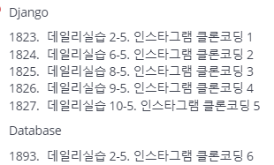

```bash
python -m venv venv # 가상환경 생성
source ./venv/Scripts/active  # 가상환경 활성
pip install django==3.2.18 # django, Pillow 등 필요 파일 설치
pip freeze > requirements.txt 
django-admin startproject crud # 프로젝트 생성
python manage.py startapp articles # app 생성
```

#### 0. base templates

### 2. app model 생성


### 3. CRUD 과정

```python
# crud > urls.py
from django.contrib import admin
from django.urls import path, include

urlpatterns = [
    path('admin/', admin.site.urls),
    path('articles/',include('articles.urls')),
]
```

1. Index

2. create

3. update

4. delete
