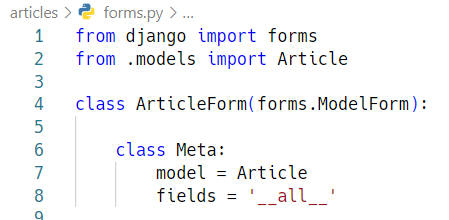

0321

### Handling HTTP requests

### 개요

- HTTP requests 처리에 따른 view 함수 구조 변화

- new-create, edit-update의 view 함수 역할을 잘 살펴보면 하나의 공통점과 하나의 차이점이 있음

- 공통점
  
  - new-create는 모두 CREATE 로직을 구현하기 위한 공통 목적
  
  - edit-update는 모두 UPATE 로직을 구현하기 위한 공통 목적

- 차이점
  
  - new와 edit는 GET 요청에 대한 처리만을, create와 update는 POST 요청에 대한 처리만을 진행

- 이 공통점과 차이점을 기반으로 하나의 view 함수에서 method에 따라 로직이 분리되도록 변경

### 

## Django Form

### 개요

- 우리는 지금까지 HTML form, input 태그를 통해서 사용자로부터 데이터를 받았음

- 현재 우리 Django 서버는 들어오는 요청을 모두 수용하고 있는데, 이러한 요청 중에는 비정상적인 혹은 악의적인 요청이 있다는 것을 생각해야 함.

- 이처럼 사용자가 입력한 데이터가 우리가 원하는 데이터 형식이 맞는지에 대한 <mark>유효성 검증</mark>이 반드시 필요
  
  - 이러한 유효성 검증은 많은 부가적인 것들을 고려해서 구현해야 하는데, 이는 개발 생산성을 늦출뿐더러 쉽지않은 작업임

- Django Form은 이 과정에서 과중한 작업과 반복 코드를 줄여줌으로써 훨씬 쉽게 유효성 검증을 진행할 수 있도록 만들어 줌

### Form 에 대한 Django의 역할

- Form은 Django의 유효성 검사 도구 중 하나로 외부의 악의적 공격 및 데이터 손상에 대한 중요한 방어 수단

- Django는 Form과 관련한 유효성 검사를<mark> 단순화하고 자동화</mark> 할 수 있는 기능을 제공하여, 개발자가 직접 작성하는 코드보다 더 안전하고 빠르게 수행하는 코드를 작성할 수 있다.
  
  - 개발자가 필요한 핵심 부분만 집중할 수 있도록 돕는 프레임 워크의 특성

### Django는 Form에 관련된 작업의 세 부분을 처리

1. 렌더링(templates)을 위한 데이터 준비 및 재구성

2. 데이터에 대한 HTML forms 생성

3. 클라이언트로부터 받은 데이터 수신 및 처리

## The Django Form Class

### 개요

- Form Class
  
  - Django form 관리 시스템의 핵심

### Form Class 선언

- Form Class를 선언하는 것은 Model Class를 선언하는 것과 비슷하다. 비슷한 이름의 필드 타입을 많이 가지고 있다. ( 다만 이름만 같을 뿐 같은 필드는 아님)

- Model과 마찬가지고 상송을 통해 선언(forms 라이브러리의 Form 클래스를 상속받음)

------코드-------

- 앱 폴더에 forms.py를 생성 후 ArticleForm Class 선언

        

### view 업데이트


### From rendering options

- <label> & <input> 쌍에 대한 3가지 출력 옵션
1. as_p() : 각 필드가 단락(<p>태그)으로 감싸져서 렌더링

2. as_ul() : 각 필드가 목록 항목(<li>)으로 감싸져서 렌더링, <ul> 태그는 직접 작성해야 함

3. as_table() : 각 필드라 

### Django의 2가지 HTML input 요소 표현

1. Form fields

2. Widgets (넓직하게 바꿔줌)

        

        

## Widgets

### 개요

- Django의 HTML input element의 표현을 담당

- 단순히 HTML 렌더링을 처리하는 것이며 유효성과 검증과 아무런 관계가 없음
  
  - 웹페이지에서 input element의 단순 raw한 렌더링만을 처리하는 것일 뿐

### Textarea 위젯 적용하기

### Django ModelForm

### 개요

Form 이유 : 입력(유저) -> 저장(DB)

- Form Class를 작성하면서 든 생각
  
  - "Model이랑 너무 중복되는 부분이 많다"

- 이미 Article Model Class에 필드에 대한 정보를 작성했는데 이를 Form에 맵핑하기 위해 Form Class에 필드를 재정의 해야만 했음

- ModelForm을 사용하면 이러한 Form을 더 쉽게 작성할 수 있음

### ModelForm Class

- Model을 통해 Form Class를 만들 수 있는 helper class

- ModelForm은 Form과 똑같은 방식으로 View 함수에서 사용

### ModelForm 선언

- forms 라이브러리에서 파생된 ModelForm 클래스를 상속받음

        

- 정의한 ModelForm 클래스 안에 Meta 클래스를 선언

- 어떤 모델을 기반으로 form을 작성할 것인지에 대한 정보를 Meta 클래스에 지정

### ModelForm에서의 Meta Class

- ModelForm의 정보를 작성하는 곳

- ModelForm을 사용할 경우 참조 할 모델이 있어야 하는데, Meta class의 model 속성이 이를 구성함
  
  - 참조하는 모델에 정의된 field 정보를 Form에 적용함

- fields 속성에  를 사용하여 모델의 모든 필드를 포함할 수 있음

- 또는 exclude 속성을 사용하여 모델에서 포함하지 않을 필드를 지정할 수 있음 (두개 동시 X)

        

### 주의사항

- Meta 클래스는 왜 여기에 작성할까 : 파이썬의 문법적 개념으로 접근 금지

- 단순히 모델 정보를 Meta라는 이름의 내부 클래스로 작성하도록 ModelForm의 설계가 이렇게 되어있을 뿐 우리는 ModelForm의 역할과 사용법을 숙지해야 함

## ModelForm with view functions

### 개요

- ModelForm으로 인한 view 함수의 구조 변화 알아보기

### Create


### "is_valid()" method

- 유효성 검사를 실행하고, 데이터가 유효한지 여부를 boolean으로 반환

- 데이터 유효성 검사를 보장하기 위한 많은 테스트에 대해 Django는 is_valid()를 제공하여 개발자의 편의를 도움

### The "save()" method

- form 인스턴스에 바인딩 된 데이터를 통해 데이터베이스 객체를 만들고 저장

- ModelForm의 하위 클래스는 키워드 인자 instance 여부를 통해 생성할 지, 수정할 지를 결정함
  
  - 제공되지 않은 경우 save()는 지정된 모델의 새 인스턴스를 만듦(CREATE)
  
  - 제공되면 save()는 해당 인스턴스를 수정(UPDATE)
  
  

### create 함수 정리하기


### UPDATE

- ModelForm의 인자 instance는 수정 대상이 되는 객체(기존 객체)를 지정
1. request.POST : 사용자가 form을 통해 전송한 데이터(새로운 데이터)

2. instance : 수정이 되는 대상


### Form 과 ModelForm

- ModelForm이 Form보다 더 좋은 것이 아니라 각자 역할이 다른 것

- Form
  
  - 사용자의 입력을 필요로 하며 직접 입력 데이터가 DB 저장에 사용되지 않거나 일부 데이터만 사용될 때
  
  - 예 : 로그인, 사용자의 데이터를 받아 인증 과정에서만 사용 후 별도로 DB에 저장 X

- ModelForm
  
  - 사용자의 입력을 필요로 하며 입력을 받은 것을 그대로 DB 필드에 맞춰 저장할 때
  
  - 데이터의 유효성 검사가 끝나면 데이터를 각각 어떤 레코드에 맵핑해야 할지 이미 알고 있기 때문에 곧바로 save() 호출이 가능

## Widgets 활용하기

### 위젯을 작성하는 2가지 방법(몰라도됨)


## Stactic files

### Static File(정적파일)

- 응답할 때 별도의 처리 없이 파일 내용을 그대로 보여주면 되는 파일
  
  - 사용자의 요청에 따라 내용이 바뀌는 것이 아니라 요청한 것을 그대로 보여주는 파일

- 파일 자체가 고정되어 있고, 서비스 중에도 추가되거나 변경되지 않고 고정 되어 있음
  
  - 예를 들어, 웹 사이트는 일반적으로 이미지, 자바 스크립트 또는 CSS와 같은 미리 준비된 추가 파일(움직이지 않는)을 제공해야 함

- Django에서는 이러한 파일들을 "static file"이라 함
  
  - Django는 staticfiles 앱을 통해 정적 파일과 관련 된 기능을 제공

- 개발자가 업로드한 파일

### Media File

- 미디어 파일

- 사용자가 웹에서 업로드하는 정적 파일(user-uploaded)

- 유저가 업로드 한 모든 정적 파일 (개발자가 한거 아님)

### 웹 서버와 정적 파일

- 웹 서버의 기본 동작
  
  - 특정위치(URL)에 있는 자원을 요청(HTTP request) 받아서
  
  - 응답(HTTP response)을 처리하고 제공(serving)하는 것

- 이는 "자원과 자원에 접근 가능한 주소가 있다"라는 의미
  
  - 예를 들어, 사진 파일은 자원이고 해당 사진 파일을 얻기 위한 경로인 웹 주소(URL)가 존재함

- 즉, 웹 서버는 요청 받은 URL로 서버에 존재하는 정적 자원(static resource)을 제공함

## Static files 구성하기

### Django 에서 정적파일을 구성하고 사용하기 위한 몇가지 단계

1. ~~INSTALLED_APPS에 django.contrib.staticfiles가 포함되어 있는지 확인하기~~

2. settings.py에서 STATIC_URL 을 정의하기

3. 앱의 static 폴더에 정적 파일을 위치하기

4. 템플릿에서 static 템플릿 태그를 사용하여 지정된 경로에 있는 정적 파일을 URL 만들기

### Static files 관련 Settings

1. ~~STATIC_ROOT~~

2. ~~STATICFILES_DIRS~~

3. STATIC_URL
- Default : None

- STATIC_ROOT에 있는 정적 파일을 참소 할 때 사용할 URL

- 개발 단계에서는 실제 정적 파일들이 저장되어 있는 app/static/ 경로 (기본 경로) 및 STATICFILES_DIRS에 정의된 추가 경로들을 ㅏㅁ색

- 실제 파일이나 디렉토리가 아니며, URL로만 존재

- 비어 있지 않은 값으로 설정 한다면 반드시 slash(/)로 끝나야 함

```python
STATIC_URL = '/static/'
STATICFILES_DIRS = [BASE_DIR / 'static,]
```

## Media Files

### ImageField()

- 이미지 업로드에 사용하는 모델 필드

- FileField를 상속 받는 서브 클래스이기 때문에 FileField의 모든 속성 및 메서드를 사용 가능

- 더해서 사용자에 의해 업로드 된 객체가 유효한 이미지인지 검사

- ImageField 인스턴스는 최대 길이가 100자인 문자열로 DB에 생성되며, max_length 인자를 사용하여 최대 길이를 변경 할 수 있음

### FileFild()

- FileField(upload_to=' ', storage=None, max_length=100, **options)

- 파일 업로드에 사용하고 있는 모델 필드

- 2개의 선택 인자를 가지고 있음
  
  1. upload_to
  
  2. ~~storage~~

### FileField / ImageField를 사용하기 위한 단계

1. settings.py에 MEDIA_ROOT, MEDIA_URL 설정

2. upload_to 속성을 정의하여 업로드 된 파일에 사용할 MEDIA_ROOT의하위 경로를 지정(선택사항)

### MEDIA_ROOT

- Default: ' '(Empty string)

- 사용자가 업로드 한 파일(미디어 파일)들을 보관할 디렉토리의 절대 경로

- Django는 성능을 위해 업로드 파일은 데이터베이스에 저장하지 않음
  
  - 데이터베이스에 저장되는 것은 "파일경로"

- MIDIA_ROOT 는 STATIC_ROOT와 반드시 다른 경로로 지정해야 함


```python
# settings.py

MEDIA_ROOT = BASE_DIR / 'media'
```

### MEDIA_URL

- Default: ' ' (Empty string)

- MEDIA_ROOT 에서 제공되는 미디어 파일을 처리하는 URL

- 업로드 된 파일의 주소(URL)를 만들어주는 역할
  
  - 웹 서버 사용자가 사용하는 public URL

- 비어 있지 않은 값으로 설정 한다면 반드시 slash(/)로 끝나야 함

- MEDIA_URL은 STATIC_URL과 반드시 다른 경로로 지정해야 함

```python
MEDIA_URL = '/media/'
```


```bash
$ python manage.py makemigrations
1
1
$ python manage.py runserver
```


이후 db, migrations 삭제

## Create

### blank

- Default : False

- True인 경우 필드를 비워 둘 수 있음
  
  - 이럴 경우 DB에는 ' '(빈 문자열)이 저장됨

- 유효성 검사에서 사용됨

### null

- Default : False

- True인 경우 Django는 빈 값을 DB에 NULL로 저장함
  
  - "Database-related"

## null 관련 주의사항

- "CharField, TextField와 같은 문자열 기반 필드에는 null 옵션 사용을 피해야 함"


```bash
python manage.py makemigrations
python manage.py migrate
python manage.py runserver
```


: 이미지 없이 글 작성시 나오는 오류


성공 ~~ 
