## REST API

## HTTP

### HTTP

- HyperText Transfer Protocol

- HTML 문서..

### HTTP 특징

- Stateless(무상태)
  
  - 동일한 연결(connection)에서 연속적으로 수행되는 두 요청 사이에 링크가 없음
  
  - 즉, 응답을 마치고 연결을 끊는 순간 클라이언트와 서버 간의 통신이 끝나며 상태 정보가 유지되지 않음

- 이는 특정 페이지와 일관되게 상호작용 하려는 사용자에게 문제가 될 수 있으며, 이를 해결하기 위해 쿠키와 세션을 사용해 서버 상태를 요청과 연결하도록 함

### HTTP Request Methods

- 리소스에 대한 행위(수행하고자 하는 동작)를 정의

- 즉, 리소스에 대해 수행할 원하는 작업을 나타내는 메서드 모음을 정의

- HTTP verbs 라고 함

- <mark>HTTP Method</mark>예시
  
  - GET, POST, PUT, DELETE ,,, 

### 대표 HTTP Request Methods

1. GET (read)
   
   - 서버에 리소스의 표현을 요청
   
   - GET 을 사용하는 요청은 데이터만 검색해야 함

2. POST(cleate)
   
   - 데이터를 지정된 리소스에 제출
   
   - 서버의 상태를 변경

3. PUT(update)
   
   - 요청한 주소의 리소스를 수정

4. DELETE
   
   - 지정된 리소스를 삭제

### HTTP response status codes

- 특정 HTTP 요청이 성곡적으로 완료 되었는지 여부를 나타냄

- 응답은 5개의 그룹으로 나뉨
  
  1. Informational reponses
  
  2. Successful responses*
  
  3. Redirection messages
  
  4. Client error responses*
  
  5. Sercer error responses*

## 

## Identifying resources on the Web

### 개요

- 웹에서 리소스를 식별하는 방법에 대해  학습

### 웹에서의 리소스 식별

- HTTP 요청의 대상을 리소스(resource,자원)라고 함

- 리소스는 문서, 사진 또는 기타 어떤 것이든 될 수 있음

- 각 리소스는 문서, 사진 또는 기타 어떤 것이든 될 수 있음

- 각 리소스는 식별을 위해 URI로 식별됨

## URI

### URI

- Uniform Resource Identifier (통합 자원 식별자)

- 인터넷에서 리소스를 식별하는 문자열

- 가장 일반적인 URI는 웹 주소로 알려진 URL

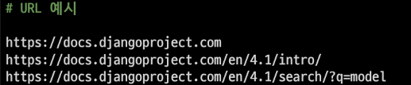

- 특정 이름공간에서 이름으로 리소스를 식별하는 URI눈 URN

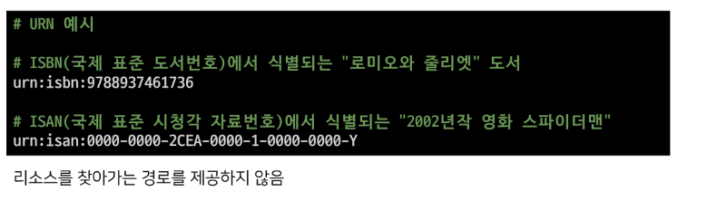

### 

## REST API

## Response JSON

### 개요

- JSON 형태로의 서버 응답 변화

- 다양한 방법의 JSON  응답

## INTRO

### 서버가 응답하는 것

- 지금까지 Django로 작성한 서버는 사용자에게 페이지(html)만 응답하고 있었음

- 하지만 사실 서버가 응답할 수 있는 것은 페이지 뿐만 아니라 다양한 데이터 타입을 응답할 수 있음

### 사전 준비

1. 사전 제공된 01_json_response 프로젝트 준비

2. 가상 환경 생성, 활성화 및 패키지 설치

3. migrate 진행

4. 준비된 fixtures 파일을 load하여 실습용 초기 데이터입력

```bash
$ python manage.py loaddata articles.json
```

- 미리 작성된 프로젝트 둘러보기

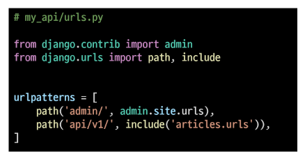

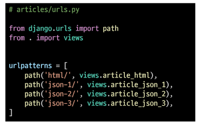

## Response

### 개요

- 다양한 방법으로 JSON 데이터 응답해보기
  
  1. HTML 응답
  
  2. JsonResponse()를 사용한 JSON 응답
  
  3. Django SErializer를 사용한 JSON 응답
  
  4. Django REST framework를 사용한 JSON 응답

### 1. HTML 응답

- 문서(HTML)한 장을 응답하는 서버 확인하기

- 지금까지 Django로 응답해오던 방식

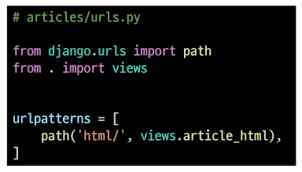

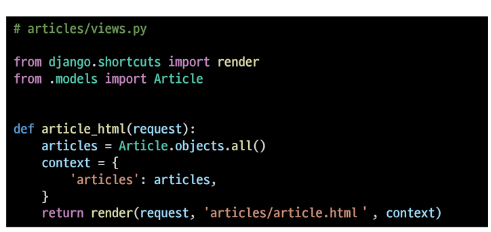

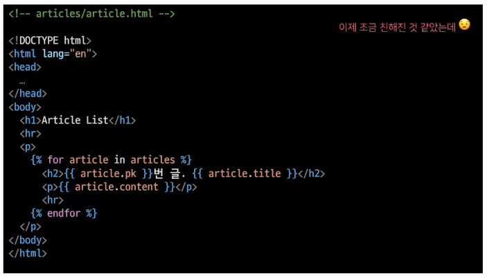

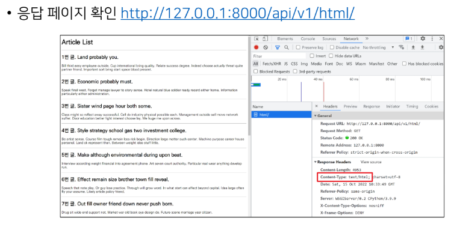

### 2. JsonResponse()를 사용한 JSON 응답

- 이제는 문서(HTML) 한 장을 응답하는 것이 아닌 JSON 데이터를 응답해보기

- Django가 기본적으로 제공하는 JsonResponse 객체를 활용하여 Python 데이터 타입을 손쉽게 JSON으로 변환하여 응답 가능

```python
def article_json_1(request):
    articles = Article.objects.all()
    articles_json = []

    for article in articles:
        articles_json.append(
            {
                'id' : article.pk,
                'title' : article.title,
                'content' : article.content,
            }
        )
    return JsonResponse(articles_json, safe=False)
```

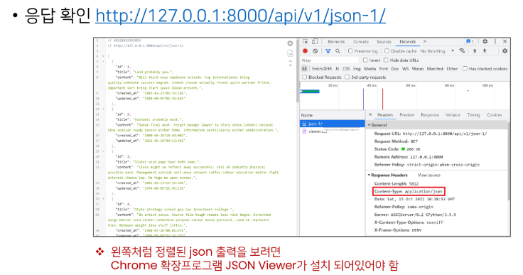

- JsonResponse()
  - JSON-encoded response를 만드는 클래스
  - 'safe' parameter
    - 기본 값 True
    - False로 설정 시 모든 타입의 객체를 serialization 할 수 있음(그렇지 않으면 dict 인스턴스만 허용됨)

### 3. Django Serializer를 사용한 JSON 응답

- Django의 내장 HttpResponse()를 활용한 JSON 응답

- 이전에는 JSON의 모든 필드를 하나부터 열까지 작성해야 했지만 이제는 그렇지 않음

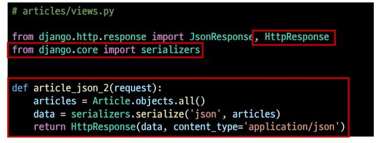

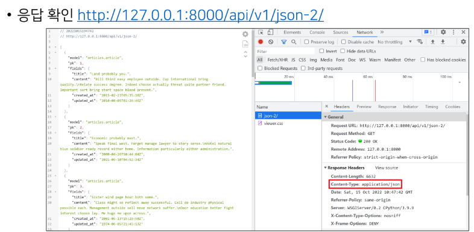

### Serialilzation

- "직렬화"

- 여러 시스템에서 활용하기 위해 데이터 구조나 객체 상태를 나중에 재구성할 수 있는 포맷으로 변환하는 과정
  
  - 즉, 어떠한 언어나 환경에서도 "나중에 다시 쉽게 사용할 수 있는 포맷으로 변환하는 과정"

- 변환 포맷은 대표적으로 json,xml,yaml이 있으면 json이 가장 보편적으로 쓰임

- 데이터 구조나 객체 상태를 나중에 재구성할 수 있는 포맷으로 변환하는 과정

### Serializers in Django

- Django의 serialize()

### 4. Django REST framework를 사용한 JSON 응답

- Django REST framework(DRF)
  
  - Django에서 Restful API 서버를 쉽게 구축할 수 있도록 도와주는 오픈소스 라이브러리
  
  - Web API 구축을 위한 강력한 toolkit을 제공
  
  - REST framework를 작성하기 위한 여러 기능을 제공
  
  - DRF의 serializer은 Django의 Form 및 ModelForm 클래스와 매우 유사하게 작동

- DRF가 설치되어 있는 것을 확인

```python
#settings.py

INSTALLED_APPS = [
    'articles',
    'django_seed',
    'rest_framework', ###
    'django.contrib.admin',
    'django.contrib.auth',
    'django.contrib.contenttypes',
    'django.contrib.sessions',
    'django.contrib.messages',
    'django.contrib.staticfiles',
]
```

- ModelForm과 유사한 ModelSerializer 구조 및 사용법 확인

```python
# articles/serializers.py

from rest_framework import serializers
from .models import Article

class ArticleSerializer(serializers.ModelSerializer):
    class Meta:
        model = Article
        fields = '__all__'
```

```python
# articles/views.py

from .serializers import ArticleSerializer

@api_view(['GET'])
def article_json_3(request):
    articles = Article.objects.all()
    serializers = ArticleSerializer(articles, many=True)
    return Response(serializers.data)
```
