# 0329

# 분할 정복 & 백트래킹

## 분할 정복 기법

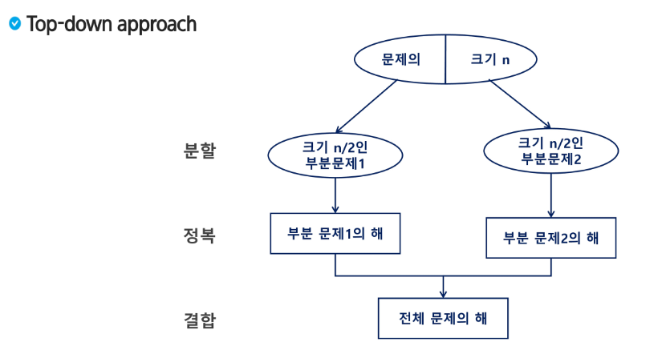

## 거듭 제곱

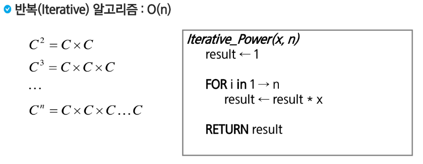

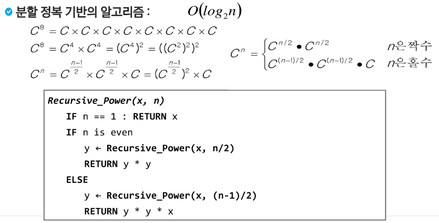

## 병합 정렬( Merge SOrt )

- 여러 개의 정렬 된 자료의 집합을 병합하여 한 개의 정렬된 집합으로 만드는 방식

- 분할 정복 알고리즘 활용
  
  - 자료를최소 단위의 문제까지 나눈 후에 차례대로 정렬하여 최종 결과를 얻어 냄
  
  - top - down 방식

- 시간 복잡도
  
  - O(n log n)

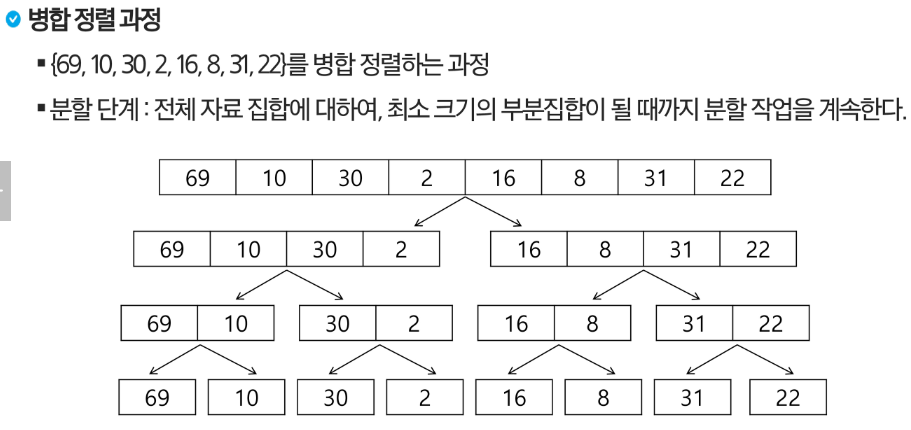

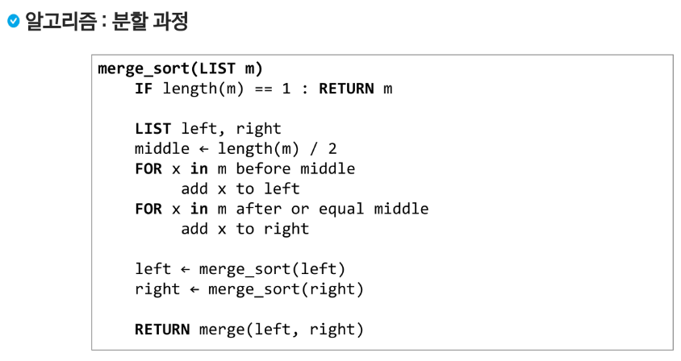

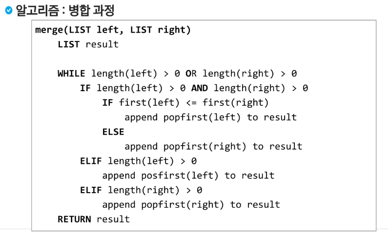

### 구현

```python
def merge(left, right):
    pass

def msort(s, e):
    ## msort(arr) 일때
    # def msort(m):
    # if len(m) == 1:
    #     return m

    # middle = len(m) // 2
    # left = m[0 : middle]
    # right = m[middle :]

    # left = msort(left)
    # right = msort(right)
    # return merge(left, right)

    if s == e:
        return
    m = (s+e) // 2
    msort(s, m) # 인덱스
    msort(m+1, e)
    # merge
    k = 0
    l, r = s, m+1 # 왼쪽과 오른쪽에서 가장 작은 숫자의 위치
    while l <= m or r <= e:
        if l <= m and r <= e:
            if arr[l] <= arr[r]:
                tmp[k] = arr[l]
                l += 1
            else:
                tmp[k] = tmp[r]
                r += 1
            k += 1
        elif l <= m:
            while l <= m:
                tmp[k] = arr[l]
                t += 1
                k += 1
        elif r <= e:
            while r <= e:
                tmp[k] = arr[r]
    i = 0
    while i < k:
        arr[s+i] =tmp [i]
    return merge()

T = int(input())
for tc in range(1, T+1):
    N = int(input())
    arr = list(map(int, input().split()))
    tmp = [0] * N

    # msort(arr)
    msort(0, N-1)
    print(arr)
```

## 퀵 정렬

- 주어진 배열을 두 개로 분할하고, 각각을 정렬한다.

- 다른점
  
  - 병합 정렬은 그냥 두 부분으로 나누는 반면에, 퀵 정렬은 분할할때, 기준 아이템(pivot item)중심으로, 이보다 작은 것은 왼편,큰 것은 오른편에 위치시킨다.
  
  - 각 부분 정렬이 끝난 후, 병합 정렬은 "병합"이란 후처리 작업이 필요하나, 퀵 정렬은 필요로 하지 않는다.
  
  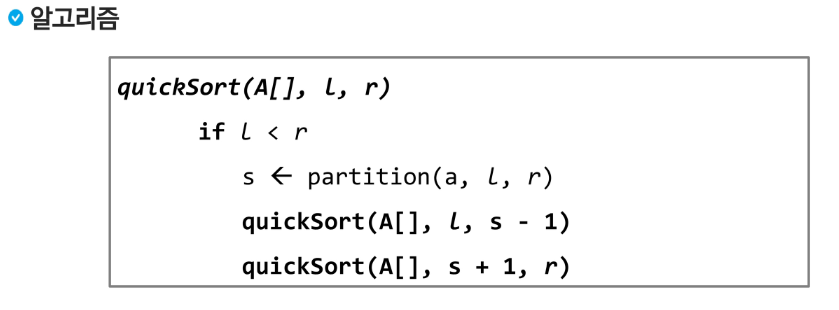

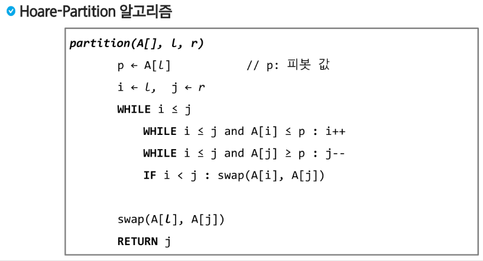

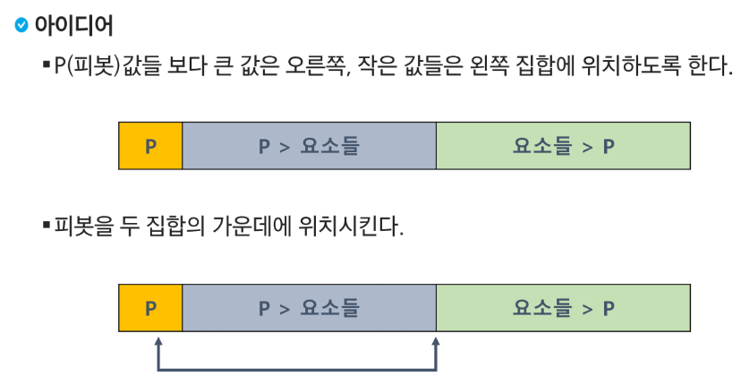

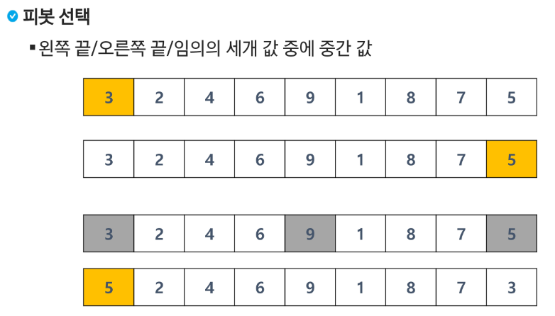

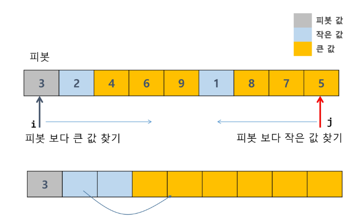

- 피봇보다 큰 값 만나면 멈춤 / 피봇모다 작은 값 만나면 멈춤

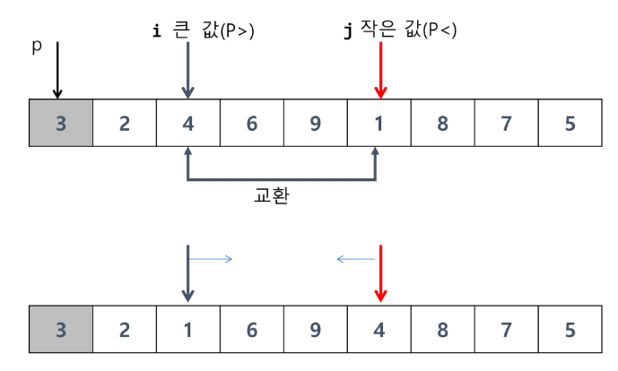

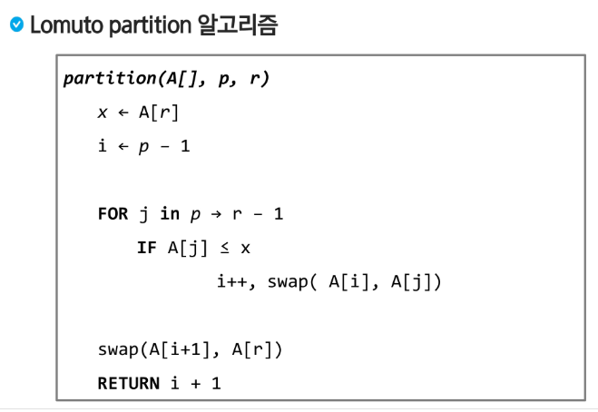

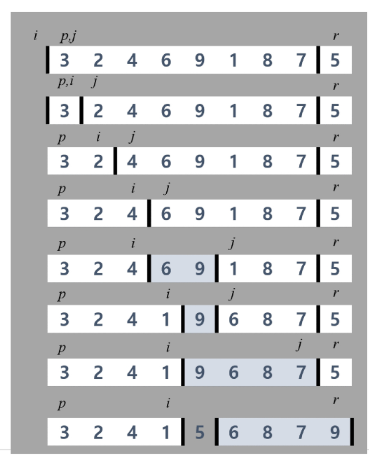

```python
def hoare(A, l, r):
    pivot = A[l] # 맨 왼쪽원소 기준
    i = l # pivot 보다 큰 값을 찾아 오른쪽으로 이동
    j = r # pivot 보다 작은 값을 찾아 왼쪽으로 이동

    while i <= j:
        while i <= j and A[i] <= pivot:
            i += 1
        while i <= j and A[j] >= pivot:
            j -= 1
        if i < j: # 교차 하지 않은 경우
            A[i], A[j] = A[j], A[i]
    A[j], A[l] = A[l], A[j]
    return j

def qsort(A, l, r):
    if l < r:
        s = hoare(A, l, r)
        qsort(A, l, s-1)
        qsort(A, s+1, r)

T = int(input())
for tc in range(1, T+1):
    N = int(input())
    arr = list(map(int, input().split()))
    qsort = list(arr, 0, N-1)
    print(arr)
```


