# 0202

### 카운팅 정렬(Counting Sort)

- 항목들의 순서를 결정하기 위해 집합에 각 항목이 몇 개씩 있는지 세는 작업을 하여, 선형 시간에 정렬하는 <mark>효율적인</mark> 알고리즘

- 제한 사항
  
  - 정수나 정수로 표현할 수 있는 자료(아스키코드)에 대해서만 적용 가능 : 각 항목의 발생 횟수를 기록하기 위해, 정수 항목으로 인덱스 되는 카운트들의 배열을 사용하기 때문이다.
  
  - 카운트들을 위한 충분한 공간을 할당하려면 집합 내의 가장 큰 정수를 알아야 한다.

- 시간 복잡도
  
  - O(n + k) : n은 리스트 길이, k는 정수의 최대값

### 카운팅 정렬 과정

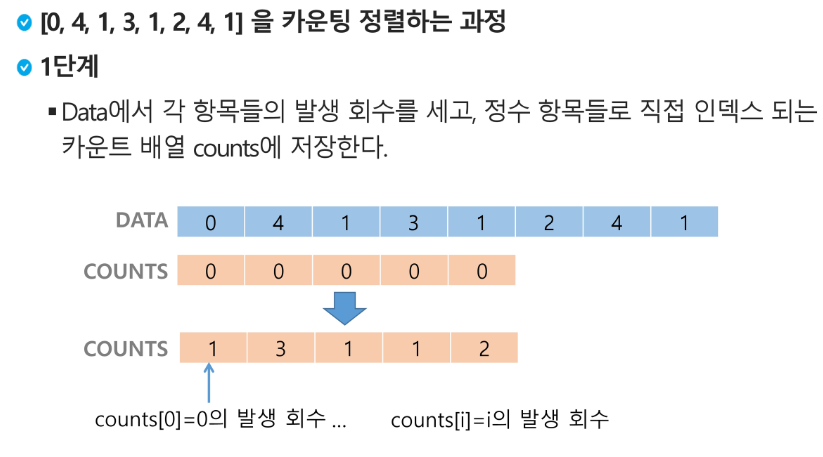

0 <= data <= 4, counts = [0] * 5(index 개수)

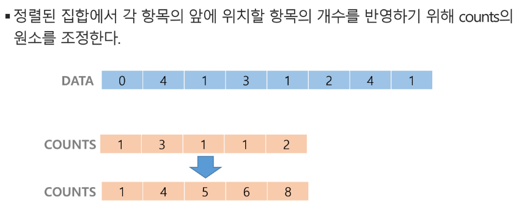

for i : 1 -> 4

    counts[i] <- counts[i-1]+counts[i]  ## 누적 코드

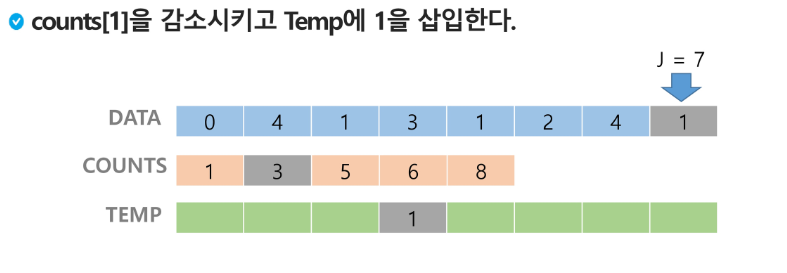

1까지 4개의 숫자가 있다했으니까 4번째 자리는 적어도 1임!

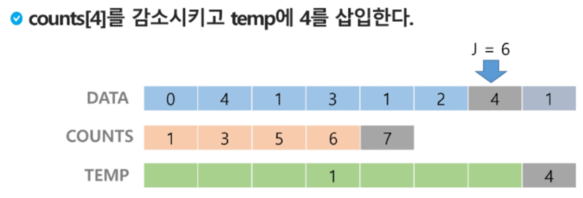

4까지의 숫자가 있는데 그때까지 8개의 숫자가 있으니까 적어도 8번째는 4 : 그러니까 8에서 1을 빼서 7번째 인덱스에 4 넣기

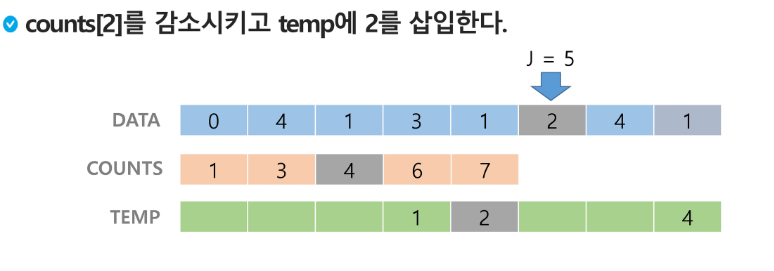

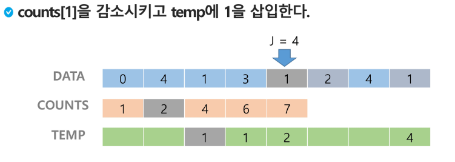

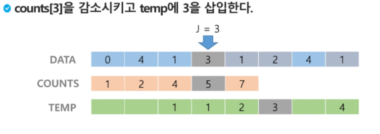

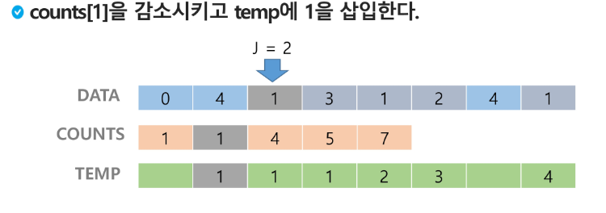

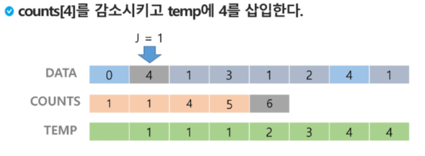

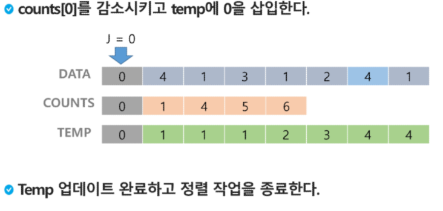

### 카운팅 정렬 알고리즘

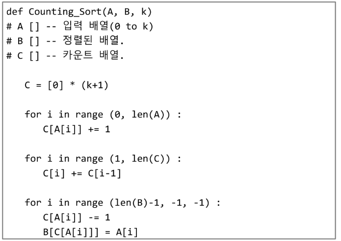

A : data

B : Temp

C : counts : counting_arr

** 누적값 만들기 !! **

for i : 1 -> 4

    counts[i] <- counts[i-1]+counts[i] ## 누적 코드

### 정렬 알고리즘 비교

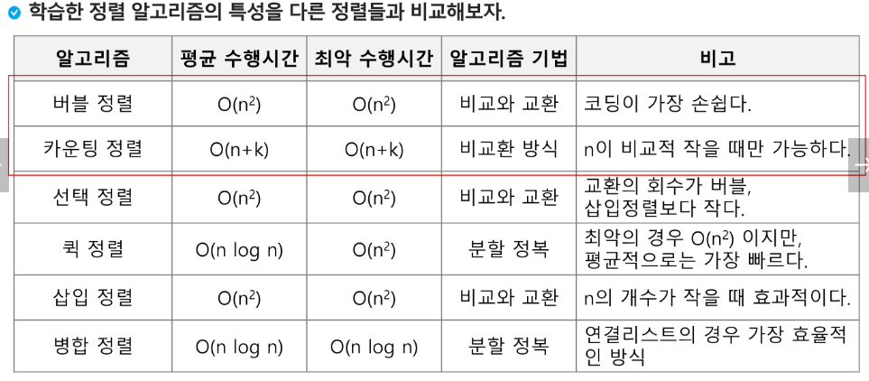

### Baby-gin Game

- 설명
  
  - 0~9 사이의 숫자 카드에서 임의의 카드 6장을 뽑았을 때, 3장의 카드가 연속적인 번호를 갖는 경우를 run이라고 하고, 3장의 카드가 동일한 번호를 갖는 경우를 triplet
  
  - 그리고, 6장의 카드가 run과 triplet로만 구성된 경우를 baby-gin으로 부른다.
  
  - 6자리의 숫자를 입력받아 baby-gin 여부를 판단하는 프로그램 작성

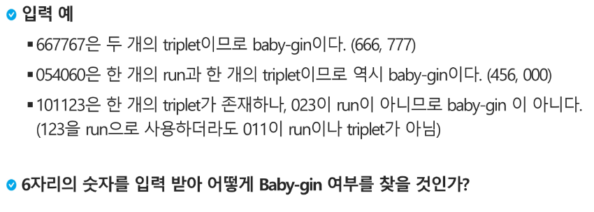

### 완전 검색(Exaustive Search)

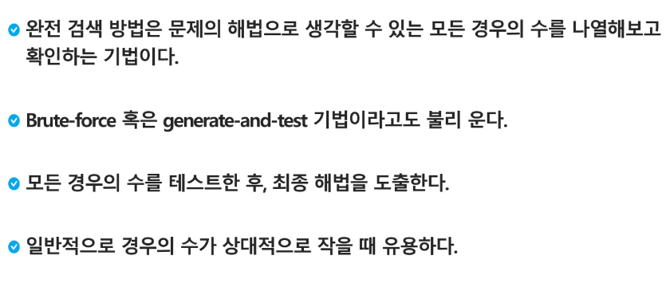

### 완전 검색으로 시작하라

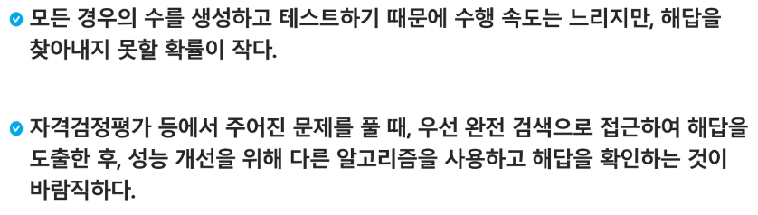

### 완전 검색을 활용한 Baby-gin 접근

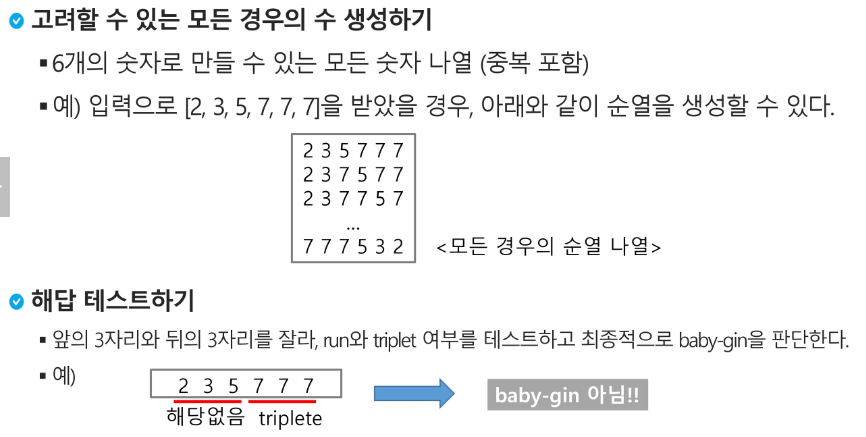

### 순열을 어떻게 생성할 것인가

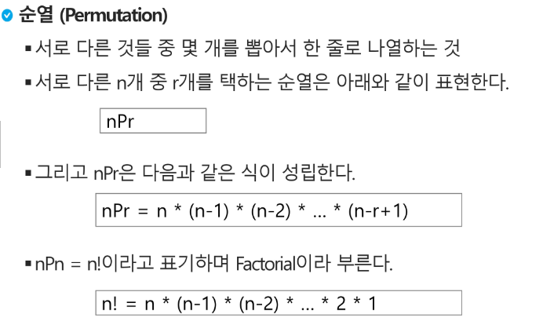

### 단순하게 순열을 생성하는 방법

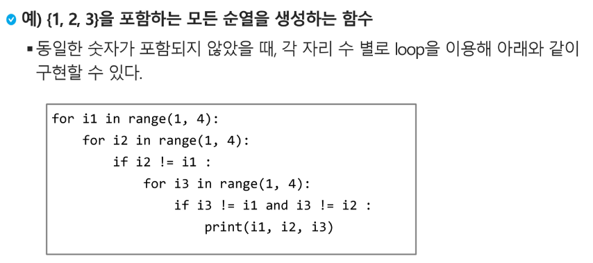

### 탐욕(Greedy) 알고리즘

- 탐욕 알고리즘은 최적해를 구하는데 사용되는 근시안적인 방법

- 여러 경우 중 하나를 결정해야 할 때마다 그 순간에 최적이라고 생각되는 것을 선택해 나가는 방식으로 진행하여 최종적인 해답에 도달한다.

- 각 선택의 시점에서 이루어지는 결정은 지역적으로는 최적이지만, 그 선택들은 계속 수집하여 최종적인 해답을 만들었다고 하여, 그것이 최적이라는 보장은 없다.

- 일반적으로, 머릿속에 떠오르는 생각을 검증 없이 바로 구현하는 Greedy 접근이 된다.

### 탐욕 알고리즘의 동작 과정

1. 해 선택 : 현재 상태에서 부분 문제의최적 해를 구한 뒤, 이를 부분해 집합(solution set)에 추가한다.

2. 실행 가능성 검사 : 새로운 부분해 집합이 실행 가능한지를 확인한다. 곧, 문제의 제약 조건을 위반하지 않는지를 검사한다.

3. 해 검사 : 새로운 부분해 집합이 문제의 해가 되는지를 확인한다. 아직 전체 문제의 해가 완성되지 않았다면 1.의 해 선택 부터 다시 시작한다.

### 탐욕 알고리즘의 예

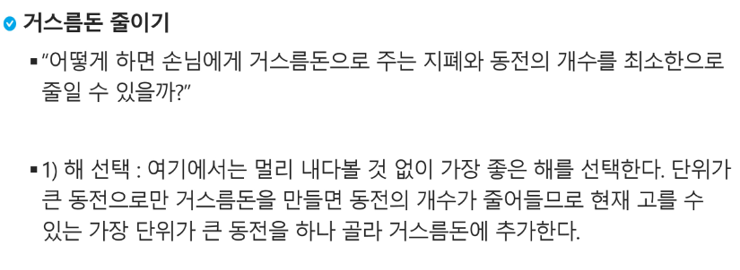

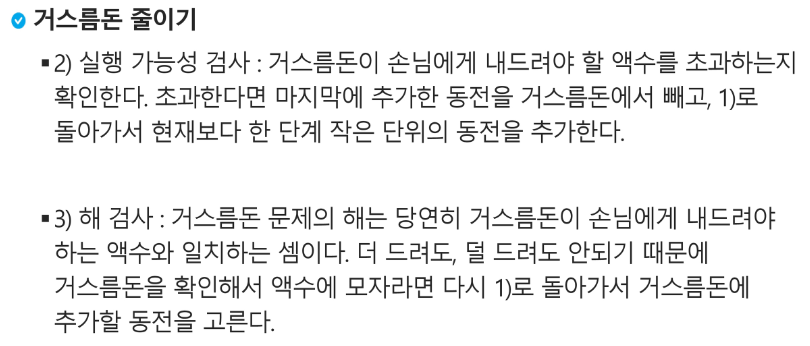

### 탐욕 알고리즘 풀이

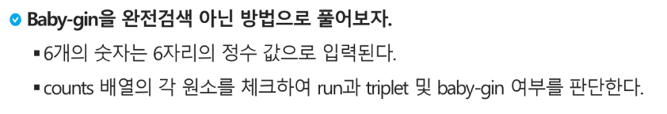

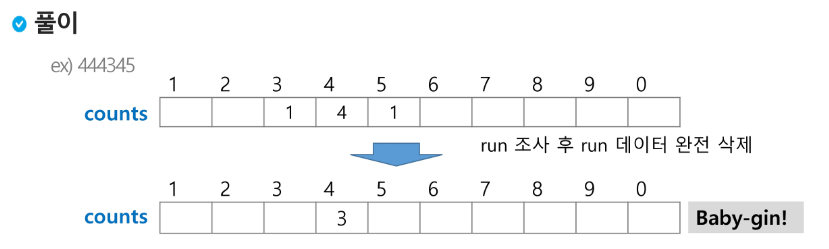

for i:0->7

333456 일때 333/456 으로 하면 baby gin 이지만 run 먼저 조사하면 33/345 /6 이 돼서 안됨

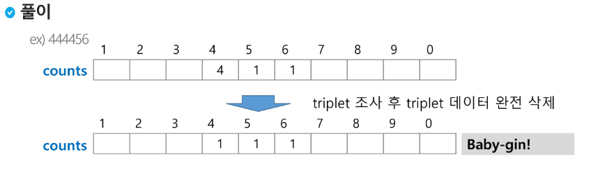

triplet 먼저 조사 : 444456 -> 444/456

? : 444456 이면 run 먼저 조사해도 456/444 돼서 상관없지 않나?

### 구현 예

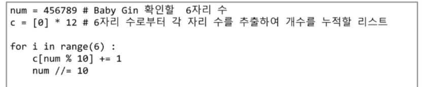

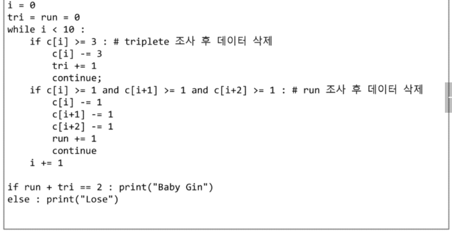

### 자주 실수하는 오답

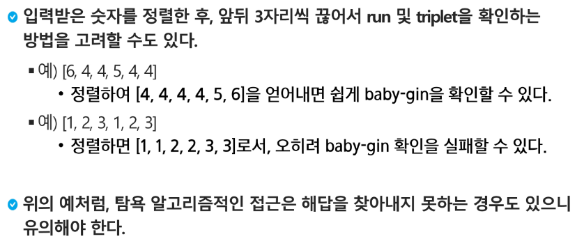
