# REACT_VLPT

## 1장

### 2. 작업환경

- 새 프로젝트 실행
  
  ```bash
  $ npx create-react-app appname
  ```

# react 실행

  $ npm start

```


< 실행 화면 >


### 3. 리액트 컴포넌트

- 컴포넌트 만들기

```js
# src/Hello.js


import React from "react"

function Hello() {
  return(

      <div>
          안녕하세용!!
      </div>
          )
}

export default Hello
```

- 리액트 컴포넌트를 만들때는 아래를 통해 리액트를 부르고 내보내줘야함
  
  ```js
  import React from 'react';
  ```
  
  export default Hello

```
- 컴포넌트 호출하기

```js
# App.js


import './App.css';
import React from 'react';
import Hello from './Hello'

function App() {
  return (
    <div>
      <Hello/>
    </div>
  );
}

export default App;
```

- 컴포넌트는 일종의 UI 조각이므로 쉽게 재사용도 가능하다

### 4. JSX

- react 에서는 <.br> <.input> 등과 같은 태그 또한 <.br/> <input/> 으로 감싸져야 한다.

- JSX 내부에  JS 변수를 보여줘야 할 때에는 {} 를 통해 보여준다.

- 인라인 스타일의 경우 객체 형태로 작성해야 한다.
  
  - 예) background-color -> backgroundColor : camelCase

- CSS class 를 설정할 때는 class = 가 아닌 className= 으로 설정해야 한다.

```js
import React from 'react';
import Hello from './Hello';
import './App.css';


function App() {
  const name = 'react';
  const style = {
    backgroundColor: 'black',
    color: 'aqua',
    fontSize: 24, // 기본 단위 px
    padding: '1rem' // 다른 단위 사용 시 문자열로 설정
  }

  return (
    <>
      {/* 주석은 화면에 보이지 않습니다 */}
      /* 중괄호로 감싸지 않으면 화면에 보입니다 */
      <Hello 
      />
      <div style={style}>{name}</div>
      <div className="gray-box"></div>
    </>
  );
}

export default App;
```

```css
.gray-box {
  background: gray;
  width: 64px;
  height: 64px;
}
```

=> 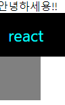

### 5. props 를 통해 컴포넌트에게 값 전달

##### props의 기본 사용법

- App 컴포넌트에서 Hello 컴포넌트를 사용 할때 name 이라는 값을 전달 해준다고 가정하자
  
  ```js
  # App.js
  ```
  
  function App(){
  
      return (
      <Hello name="react"/>
  
  )
  }

```
```js
# Hello.js


function Hello(props){
    return(
        <div>
            안녕하세요 {props.name}
        <div>
    )
}
```

- 컴포넌트에게 전달되는 props는 파라미터를 통하여 조회가능

- props 는 객체 형태로 전달되며, props.name 과 형태로 조회

##### 여러개의 props, 비구조화 할당

- Hello 컴포넌트에 또 다른 props를 전달할 경우
  
  ```js
  # App.js
  
  function App(){
      return (
          <Hello name="react" color="red"/>
      )
  }
  ```
  
  ```js
  # Hello.js
  ```

##### defaultProps로 기본값 설정

- 컴포넌트에 props를 지정하지 않았을 때 기본적으로 사용 할 값을 설정하고 싶다면 컴포넌트에 defaultProps 값 설정
  
  ```js
  # Wrapper.js
  ```
  
  import React from "react";
  
  function Wrapper({children}){
  
      const style = {
          border: '2px solid black',
          padding: '16px',
      }
      return (
          <div style={style}>
              {children}
          </div>
      )
  
  }
  
  export default Wrapper

```
```js
# App.js
```

### 6. 조건부 렌더링

- 조건부 렌더링 : 특정 조건에 따라 다른 결과물을 렌더링 하는 것

- App 컴포넌트에서 Hello 컴포넌트를 사용할때, isSpecial 이라는 props 설정
  
  - App.js
  
  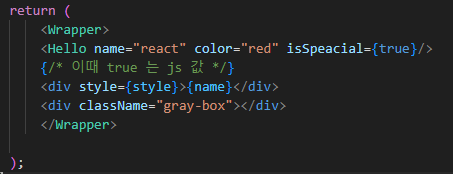
  
  - Hello.js
  
  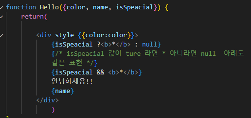

##### props 값 설정을 생략하면 ={true}

```js
isSpeacial={true} = isSpeacial
```

### 7. useState 를 통해 컴포넌트에서 바뀌는 값 관리하기

- Counter.js
  
  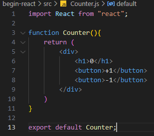

- App.js
  
  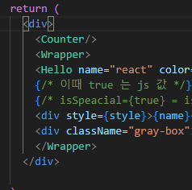

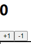

##### 이벤트 설정

- 버튼이 클릭되는 이벤트 발생했을 때, 특정 함수 호출
  
  - Counter.js
    
    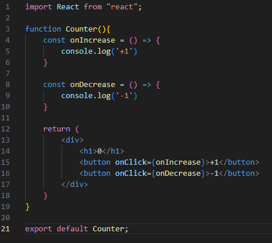

##### 동적인 값 끼얹기, useState

컴포넌트에서 동적인 값 : 상태(state) -> useState

```js
import React, {useStatee} from 'reaect'
```

- Counter.js
  
  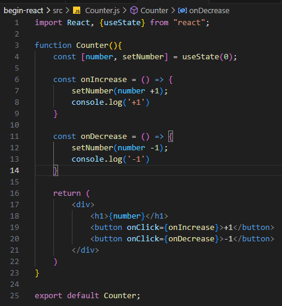

##### 함수형 업데이트

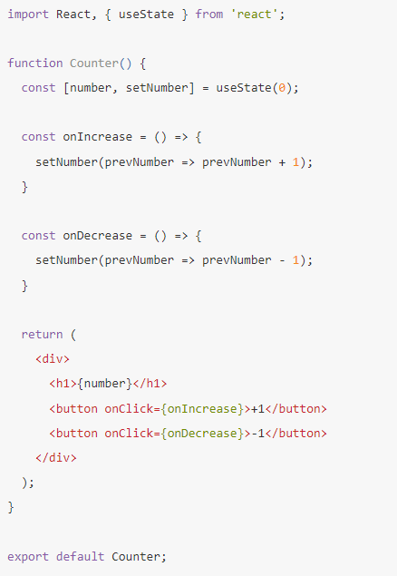

- onIncreasee, onDecrease => setNumber을 사용할때 그 다음 상태를 파라미터가 아닌, 값을 업데이터하는 함수를 파라미터로 넣어주어도 된다.

- 컴포넌트를 최적화 하게 될 때 사용하게 됨


### 8. input 상태 관리하기

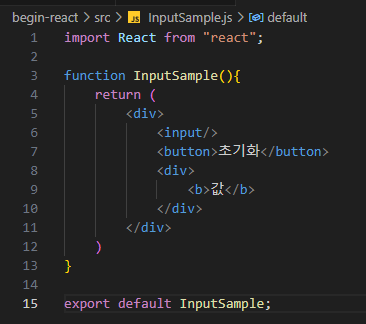

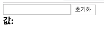

- useState를 사용

- input 의 onChange 이벤트를 사용


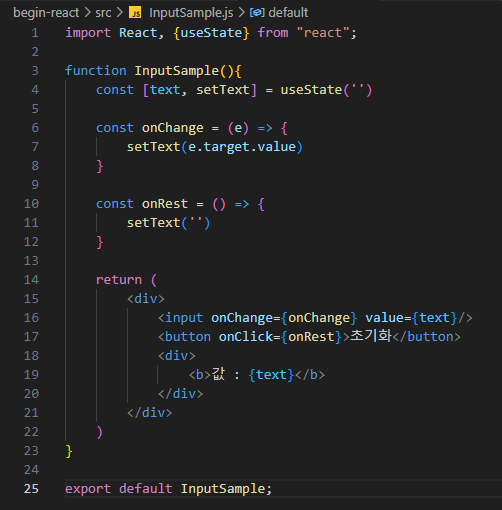

- input 값에 text를 입력할때마다 text에 값이 나옴


### 9. 여러개의 input 상태 관리하기

- input 값이 비워져 있을때 input에 대한 설명을 보여주는 placeholder 값 설정


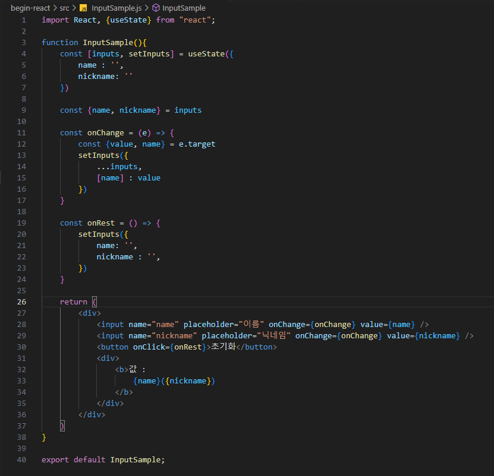
