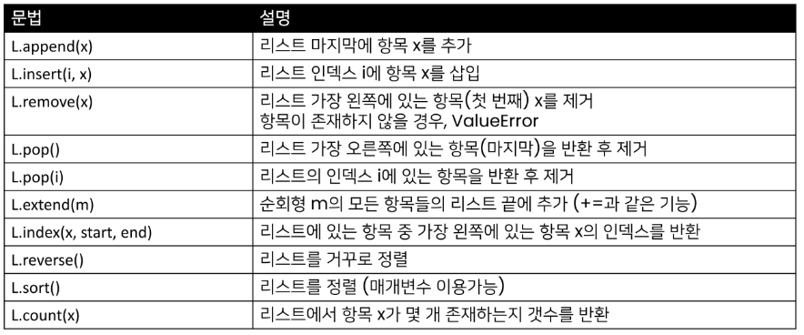

# 0125

## 데이터구조

### 데이터 구조?

- 데이터 구조(Data Structure) : 자료구조
  
  "어떠한 데이터? + 어떤 연산?''
  
  - 여러 데이터를 효과적으로 사용, 관리하기 위한 구조(많이 사용해보니까, 비슷한 구조가 있음)
  
  - 파이썬에는 대표적으로 List, Tuple, Dict, Set 등의 데이터 구조가 있음

### 자료구조

- 컴퓨터 공학에서는'자료구조'라고 함 (파이썬에서의 구조 아님)

- 각데이터의 효율적인 저장, 관리를 위한 구조를 나눠놓은 것

### 데이터 구조 활용하기

- 데이터 구조를 활용하기 위해서는 메서드(method)를 활용
  
  - 메서드(*함수*)는 ~~클래스~~ 내부에 정의한 함수, 사실상 함수 동일
  
  - 쉽게 설명하자면 객체의 기능(추후 객체 지향 프로그래밍에서 학습)

데이터 구조. 메서드() 형태로 활용! <= 메서드 : 함수

어렵게 느껴진다면! 주어.동사()

- 메서드랑 함수랑 큰 차이없음

- 하지만? 함수는 내가 지정 하는 것, 메서드는 주어가 있다

### 데이터 구조 활용 예시

### 파이썬 공식 문서의 표기법

- python 구문이 아니며, 문법을 표현하기 위한 것임

- 아래 예시에서 str.replace(old,nem[,count])
  
  - old, new는 필수 /[,count]는 선택적 인자를 의미

## 문자열

### 문자열(String Type)

- 문자들의 나열(sequence of characters)
  
  - 모든 문자는 str 타입 (변경 불가능한 immutable)

- 문자열은 작은따옴표(')나 큰 따옴표(")를 활용하여 표기
  
  - 문자열을 묶을 때 동일한 문장부호를 활용
  
  - PEP8에서는 소스코드 내에서 하나의 문장부호를 선택하여 유지하도록 함

### 문자열 조회/탐색 및 검증 메서드

암기X , s는 문자열

### 문자열은 불면형인데, 문자열 변경이 되는 이유?

- 기존의 문자열을 변경하는 게 아니라, 변경된 문자열을 새롭게 만들어서 반환
  
  - 예) replace, strip, title 등

## 리스트

### 리스트(list)

- 리스트는 여러 개의 값을 **순서가 있는 구조로 저장**하고 싶을 때 사용

### 리스트의 생성과 접근

- 리스트는 대괄호([]) 혹은 list()를 통해 생성

- 순서가 있는 시퀀스로 인덱스를 통해 접근 가능

### 리스트 메서드

## 튜플

### 튜플(tuble)의 정의

- 튜플은 여러 개의 값을 순서가 있는 구조로 저장하고 싶을 때 사용
  
  - 리스트와의차이점은 생성 후, 담고 있는 값 <u>변경이 불가</u>( 불변 자료형 )
    
    - 파이썬이 내부적으로 값을 다룰 때 튜플 이용 : 사용자가 어떠한 리스트를 넣었을 때, 파이썬은 이 리스트의 순서를 보장해서 로직을 돌려야함

- 항상 소괄호 형태로 사용

### 튜플 관련 메서드

- 튜플은 변경할 수 없기 때문에 값에 영향을 미치지 않는 메서드만을 지원

- 리스트 메서드 중<u> 항목을 변경하는 메서드들을 제외</u>하고 대부분 동일

## 연산자

### 멤버십 연산자(Membership Operator)

- 멤버십 연산자 in을 통해 특정 요소가 속해 있는지 여부를 확인

- 포함 여부 확인
  
  - in
  
  - not in

### 시퀀스형 연산자 (Sequence Type Operator)

- 산술연산자(+)
  
  - 시퀀스 간의 concatenation (연결/연쇄)

- 반복연산자(*)
  
  - 시퀀스를 반복
