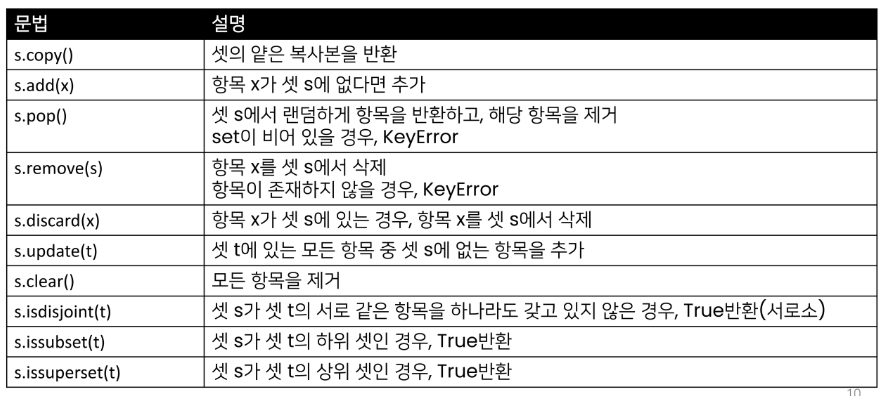
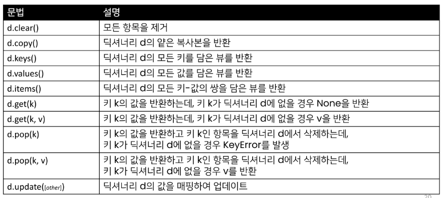

# 0126

## 데이터 구조

### 데이터 구조란?

자료구조? : 데이터를 효율적으로 저장, 관리하기 위한 구조

- 데이터 구조(Data Structure)
  
  - 여러 데이터를 효과적으로 사용, 관리하기 위한 구조 ( 많이 사용해보니까, 비슷한 구조가 있음)
  
  - 파이썬에는 대표적으로 List, Tuple, Dict, Set 등의 데이터 구조가 있음

### 자료구조

- 컴퓨터 공학에서는 '자료구조'라고 함

- 각 데이터의 효율적인 저장,관리를 위한 구조를 나눠 놓은 것

## 순서가 없는 데이터 구조

## 셋(Set)

### 셋(Set)

- Set이란<u> 중복되는 요소가 없이</u>, 순서에 상관없는 데이터들의 묶음
  
  - 데이터의 중복을 허용하지 않기 때문에 중복되는 원소가 있다면 하나만 저장
  
  - 순서가 없기 때문에 인덱스를 이용한 접근 불가능

- 수학에서의 집합을 표현한 컨테이너
  
  - 집합 연산이 가능(여집합을 표현하는 연산자는 별도로 존재 X)
  
  - 중복된 값이 존재하지 않음

- 담고 있는 요소를 삽입 변경, 삭제 가능 -> 가변 자료형(mutable)

### 셋 메서드(s는 셋)




## 딕셔너리 (Dictionary)

### 딕셔너리의 정의

- 키-값(key-value) 쌍으로 이뤄진 자료형

- Dictionary의 키(key)
  
  - key는 변경 불가능한 데이터(immutable)만 활용 가능
    
    - string, integer, float, boolean, tuple, range

- 각 키의 값(values)
  
  - 어떠한 형태든 관계없음

### 딕셔너리 메서드(d는 딕셔너리)



* d.keys(), d.values(), <mark>d.get(k)</mark>, d.get(k,v) 는 기억해두기

## 얕은 복사와 깊은 복사

### 자료형과 메모리

데이터 10을 컴퓨터가 기억하는 과정

1. 10을 저장할 공간을 메모리에 만들고

2. 저장할 공간에 대한 주소를 할당받는다

3. 할당 받은 주소를 기억했다가

4. 10이라는 데이터를 해당 주소로 찾아가서 저장한다

5. 이후에 10이 필요해지면 해당 주소로 가서 읽어온다

### 기존 변수 사용 과정에서의 문제점?

하나의 기억에, 하나의 주소가 필요 == 100개 저장하려면 주소 100개 필요함


연속적인 공간에 데이터가 저장되도록 함 == 맨 처음 기억의 주소만 가지고 있으면 되잖아


### 복사 방법

- 할당(Assignment)

- 얕은 복사(Shallow copy)

- 깊은 복사(Deep copy)

### 할당

- 대입 연산자(=)
  
  - 리스트 복사 확인하기

### 얕은 복사(shallow copy)

Slice 연산자 활용하여 같은원소를 가진 리스트지만 연산된 결과를 복사(다른 주소)

### 얕은 복사 주의사항

복사하는 리스트의 원소가 주소를 참조하는 경우


** 리스트 같은게 다른데 할당할 때 주소참조 방식이라 그냥 할당하면 안된다

```python
a = [1,2,3]
b = a

b[0] = 0
print(a) # [0,2,3]
print(b) # [0,2,3]
```

** 그냥 단순히 할당하면 아예 같은 주소를 보고있어서 값을 바꾸면 둘다 바뀌게 됨 그걸 방지하는게 얕은복사 깊은복사


```python
a = [1,2,3]
b = a.copy()

b[0] = 0
print(a)
# >>> [1,2,3]
print(b)
# >>>[0,2,3]
```


#### 2차배열

```python
a = [[1,2,3],
     [4,5,6],
     [7,8,9]]

b = a.copy()

b[0] = [0,1,2]

for i in a:
    print(i)

print("##########")

for i in b:
    print(i)
```

```python
from copy import deepcopy

a = [[1,2,3],
     [4,5,6],
     [7,8,9]]

b = deepcopy(a)

b[0][0] = 0

for i in a:
    print(i)

print("##########")

for i in b:
    print(i)
```

이런식으로 깊은 복사를 이용하면 됨

쉽게말해서 얕은복사는 1차원적인 복사, 깊은 복사는 데이터 전체적인 복사


