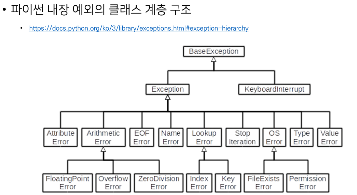

# 0131

## 객체 지향의 핵심 개념

### 객체지향의 핵심 4가지

- 추상화 : 핵심이 되는 부분만 추리기

- 상속 : 코드의 재사용성을 높이면서 기능을 확장

- 다형성 : 각자의 특성에 따라서 다른 결과 만들기

- 캡슐화 : 데이터를 보호하기

## 추상화

### 추상화

- 현실 세계를 프로그램 설계에 반영
  
  - 복잡한 것은 숨기고, 필요한 것만 드러내기

## 상속

### 상속

- 상속이란 : 두 클래스 사이 부모 - 자식 관계를 정립하는 것

- 클래스는 상속이 가능함 : 모든 파이썬 클래스는 object를 상속 받음

- 하위 클래스는 상위 클래스에 정의된 속성, 행동, 관계 및 제약 조건을 모두 상속 받음

- 부모클래스의 속성, 메서드가 자식 클래스에 상속되므로, <u>코드 재사용성이 높아짐</u>

### 상속 관련 함수와 메서드

- isinstance(object, classinfo)
  
  - classinfo의 instance거나 subclass*인 경우 True

- issubclass(class, classinfo)
  
  - class가 classinfo의 subclass면 True
  
  - classinfo의 모든 항목을 검사

- super()
  
  - 자식클래스에서 부모클래스를 사용하고 싶은 경우

### 상속 정리

- 파이썬의 모든 클래스는 object로부터 상속됨

- 부모 클래스의 모든 요소(속성, 메서드)가 상속됨

- super()를 통해 부모 클래스의 요소를 호출할 수 있음

- 상속관계에서의 이름 공간은 인스턴스, 자식 클래스, 부모 클래스 순으로 탐색

### 다중 상속

- 두개 이상의 클래스를 상속 받는 경우

- 상속받은 모든 클래스의 요소를 활용 가능함

- <mark>중복된 속성이나 메서드가 있는 경우 상속 순서에 의해 결정됨</mark>

### 상속 관련 함수와 메서드

- mro 메서드 (Method Resolution Order)
  
  - 해당 인스턴스의 클래스가 어떤 부모 클래스를 가지는지 확인하는 메서드
  
  - 기존의 인스턴스 -> 클래스 순으로 이름 공간을 탐색하는 과정에서 상속 관계에 있으면 인스턴스 -> 자식 클래스 -> 부모 클래스로 확장

## 다형성

### 다형성

- 다형성(Polymorphism)이란?
  
  - 여러 모양을 뜻하는 그리스어
  
  - 동일한 메서드가 클래스에 따라 다르게 행동할 수 있음을 의미
  
  - 즉, 서로 다른 클래스에 속해있는 객체들이 <mark>동일한 메시지에 대해 다른 방식으로 응답할 수 있음</mark>

### 메서드 오버라이딩

- 상속받은 메서드를 재정의
  
  - 클래스 상속 시, 부모 클래스에서 정의한 메서드를 자식 클래스에서 변경
  
  - 부모 클래스의 메서드 이름과 기본 기능은 그대로 사용하지만, 특정 기능을 바꾸고 싶을때 사용
  
  - 상속받은 클래스에서 같은 이름의 메서드로 덮어씀
  
  - 부모 클래스의 메서드를 실행시키고 싶은 경우 super를 활용

## 캡슐화

### 캡슐화

- 객체의 일부 구현 내용에 대해 <u>외부로부터</u>의 <u>직접적인</u> 액세스(접근)를 차단
  
  - 예) 주민등록번호

- 파이썬에서 암묵적으로 존재하지만, 언어적으로는 존재하지 않음

### 접근제어자 종류

- public Access Modifier : 모두 가능

- Protected Access Modifier : 상속 관계에서만 가능

- Private Access Modifier : 나만 ~~

### Public Member

- 언더바 없이 시작하는 메서드나 속성

- 어디서나 호출이 가능,하위 클래스 override 활용

- 일반적으로 작성되는 메서드와 속성의 대다수를 차지

### Protected Member(개념적으로만 존재)

- 언더바 1개로 시작하는 메서드나 속성

- 암묵적 규칙에 의해 부모 클래스 내부와 자식 클래스에서만 호출 가능

- 하위 클래스 override 허용

### Private Member

- 언더바 2개로 시작하는 메서드(함수)나 속성(변수)

- 본 클래스 내부에서만 사용이 가능

- 하위클래스 상속 및 호출 불가능(오류)

- 외부 호출 불가능(오류)

### getter 메서드와 setter 메서드

- 변수에 접근할 수 있는 메서드를 별도로 생성
  
  - getter 메서드 : 변수의 값을 읽는 메서드
    
    - @property 데코레이터 사용

- setter 메서드 : 변수의 값을 설정하는 성격의 메서드
  
  - @변수.setter 사용

## 디버깅

### 버그란?

- 최초의 버스는 1945년 프로그래밍 언어의 일종인코볼 발명자 그레이스 호퍼가 발견

- 역사상 최초의 컴퓨터 버스는 Mark II 라는 컴퓨터 회로에 벌레인 나방이 들어가 합선을일으켜 비정상적으로 동작

- 이때부터 소프트웨어에서 발생하는 문제를 버그라고 부름

### 디버깅의 정의

- 잘못된 프로그램을 수정하는 것을 디버깅이라함 de + bugging

- 에러 메시지가 발생하는 경우
  
  - 해당 하는 위치를 찾아 메시지를 해결

- 로직 에러가 발생하는 경우
  
  - 명시적인 에러 메시지 없이 예상과 다른 결과가 나온 경우
    
    - 정상적으로 동작하였던 코드 이후 작성된 코드를 생각해봄
    
    - 전체 코드를 살펴봄
    
    - 휴식을 가져봄
    
    - 누군가에게 설명해봄
    
    - ... 

### 디버깅

- print 함수 활용
  
  - 특정 함수 결과, 반복/조건 결과 등 나눠서 생각, 코드를 bisection으로 나눠서 생각

- 개발 환경(text editor, IDE) 등에서 제공하는 기능 활용
  
  - breakpoint, 변수 조회

### 에러와 예외

### 문법 에러(Syntax Error)

- SyntaxError가 발생하면, 파이썬 프로그램은 실행되지 않음

- 파일이름, 줄번소, ^ 문자를 통해 파이썬 코드를 읽어 나갈 때(parser) 문제가 발생한 위치를 표현

- 줄에서 에러가 감지된 가장 앞의 위치를 가리키는 캐럿(caret)기호(^) 를 표시

### 예외(Exception)

- 실행 도중 예상치 못한 상황을 맞이하면, 프로그램 실행을 멈춤
  
  - 문장이나 표현식이 문법적으로 올바르더라도 발생하는 에러

- 실행 중에 감지되는 에러들을 예외(Exception)라고 부름

- 에외는 여러타입(type)으로 나타나고, 타입이 메시지의 일부로 출력됨
  
  - NameError, TypeError 등은 발생한 예외 타입의 종류(이름)

- 모든 내장 예외는 Exception Class를 상속받아 이뤄짐

- 사용자 정의 예외를 만들어 관리할 수 있음

### 파이썬 내장 예외 (built-in-exceptions)

- 파이썬 내장예외의 클래스 계층 구조

## 예외처리

