# 0201

## 1. 배열 1(Array 1)

### 알고리즘

- (명) 알고리즘 : 유한한 단계를 통해 <u>문제를 해결하기 위한 절차나 방법</u>이다. 주로 컴퓨터용어로 쓰이며, 컴퓨터가 어떤 일을 수행하기 위한 단계적 방법을 말한다.

- 간단하게 다시 말하면 어떠한<u> 문제를 해결하기 위한 절차</u>

- 예를 들어 1부터 100까지의 합을 구하는 문제를 생각해 보자.

- 컴퓨터 분야에서 알고리즘을 표현하는 방법은 크게 두 가지
  
  - 의사코드(슈도 코드, Pseudocode)와 순서도

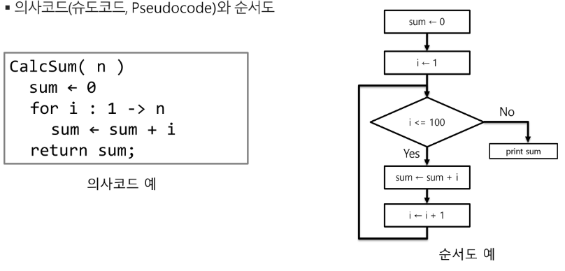

### 알고리즘의 성능은 무엇으로 측정하는가

- 무엇이 좋은 알고리즘인가?
  
  1. 정확성 : 얼마나 정확하게 동작하는가
  
  2. 작업량 : 얼마나 적은 연산으로 원하는 결과를 얻어 내는가
  
  3. 메모리 사용량 : 얼마나 적은 메모리를 사용하는가
  
  4. 단순성 : 얼마나 단순한가
  
  5. 최적성 : 더 이상 개선할 여지없이 최적화 되었는가

- 알고리즘의 작업량을 표현할 때 시간 복잡도로 표현

- <mark>시간 복잡도(Time Complexity)</mark>
  
  - 실제 걸리는 시간을 측정
  
  - 실행되는 명령문의 개수를 계산
  
  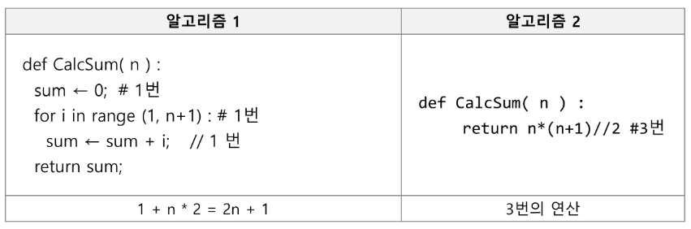

- 시간 복잡도 = 빅-오(O) 표기법
  
  - 시간 복잡도 함수 중에서 가장 큰 영향령을 주는 n에 대한 항만을 표시
  
  - 계수(Cofficient)는 생략하여 표시
    
    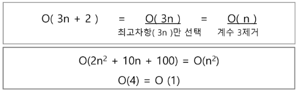
  
  - n개의 데이터를 입력받아 저장한 후 각 데이터에 1씩 증가시킨 후 각 데이터를 화면에 출력하는 알고리즘의 시간 복잡도는?
    
    답) O(n)

- 시간 복잡도별 실제 실행 시간 비교

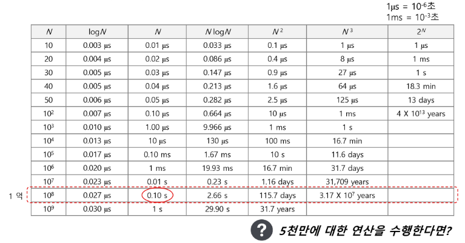

## 배열

- 배열이란 무엇인가
  
  - 일정한 자료형의 변수들을 하나의 이름으로 열거하여 사용하는 자료구조
  
  - 아래의 예는 6개의 변수를 사용해야 하는 경우, 이를 배열로 바꾸어 사용하는 것이다.

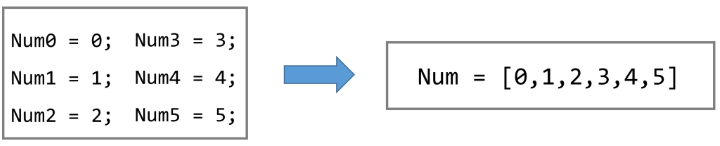

아래 그림 방식으로 

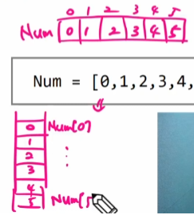

- 배열의 필요성
  
  - 프로그램 내에서 여러 개의 변수가 필요할 때, 일일이 다른 변수명을 이용하여 자료에 접근하는 것은 매우 비효율적
  
  - 배열을 사용하면 하나의 선언을 통해서 둘 이상의 변수를 선언할 수 있다.
  
  - 단순히 다수의 변수 선언을 의미하는 것이 아니라, 다수의 변수로는 하기 힘든 작업을 배열을 활용해 쉽게 할 수 있다.

### 1차원 배열

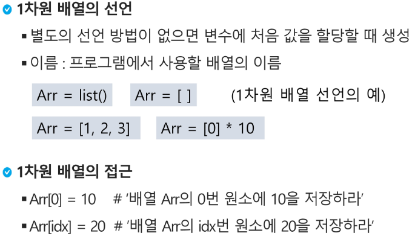

### 연습문제

- 배결 활용 예제 : Gravity
  
  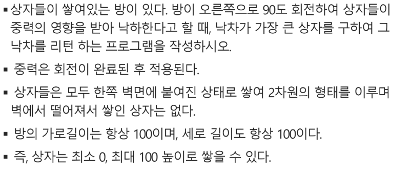

- 그림 설명

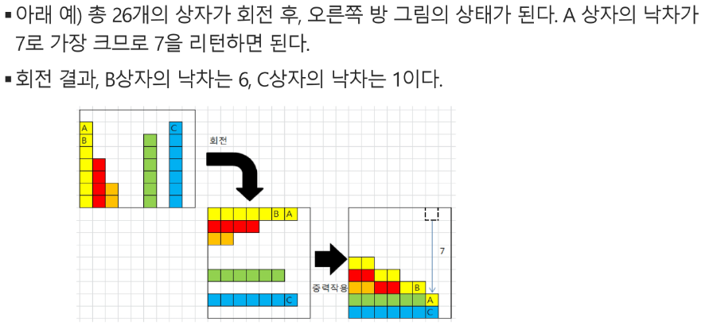

```python
list(map(int,input().split()))
```

오른쪽에 더 작은 개수 중 가장 큰 값

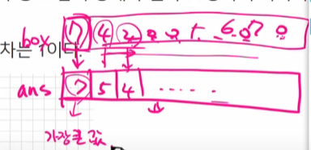

```python
max
```

** 내장함수 사용금지...ㅠㅠ

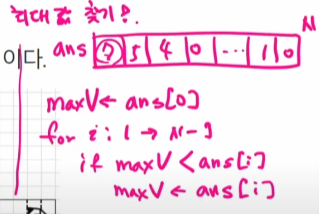 함수 쓰지않고 풀어보기

ㅠㅠ 하기싫어

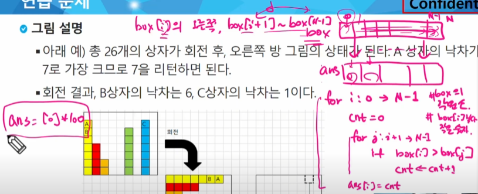

숫자 받기 -> 최소 최댓값 -> 가장 작은, 큰 위치 -> 최대값이 중복일때 맨 왼쪽? 오른쪽? 선택

### 정렬

- 2개 이상의 자료를 특정 기준에 의해 작은 값부터 큰 값(오름차순 : ascending), 혹은 그 반대의 순서대로(내림차순 : descending) 재배열 하는 것

- 키
  
  - 자료를 정렬하는 기준이 되는 특정 값

- 대표적인 정렬 방식의 종류
  
  - <mark>버블 정렬(Bubble Sort)</mark>
  
  - 카운팅 정렬(Counting Sort)
  
  - <mark>선택 정렬(Selection Sort)</mark>
  
  - 퀵 정렬(Quick Sort)
  
  - 삽입 정렬(Insertion Sort)
  
  - 병합 정렬(Merge Sort)

### 버블 정렬(Bubble Sort)

- 인접한 두 개의 원소를 비교하며 자리를 계속 교환하는 방식

- 정렬 과정
  
  - 첫 번째 원소부터 인접한 원소끼리 계속 자리를 교환하면서 맨 마지막 자리까지 이동
  
  - 한 단계가 끝나면 가장 큰 원소가 마지막 자리로 정렬된다.
  
  - 교환하며 자리를 이동하는 모습이 물 위에 올라오는 거품 모양과 같다고 하여 버블 정렬이라고 한다.

- 시간 복잡도
  
  - O(n^2)

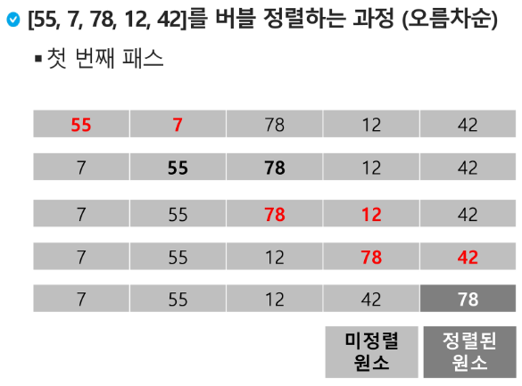

- 배열을 활용한 버블 정렬
  
  - 앞서 살펴본 정렬 과정을 코드로 구현(오름차순)
  
  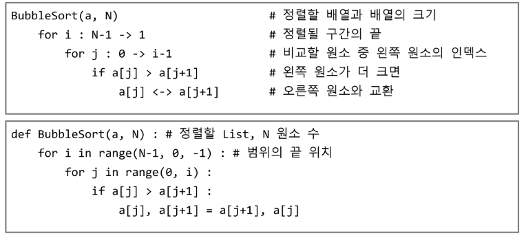

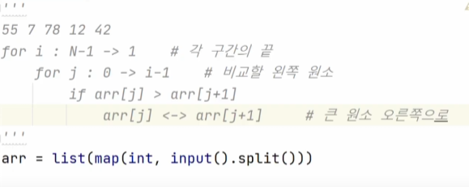

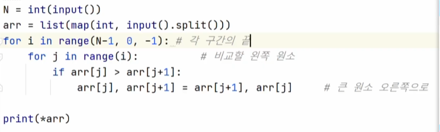
