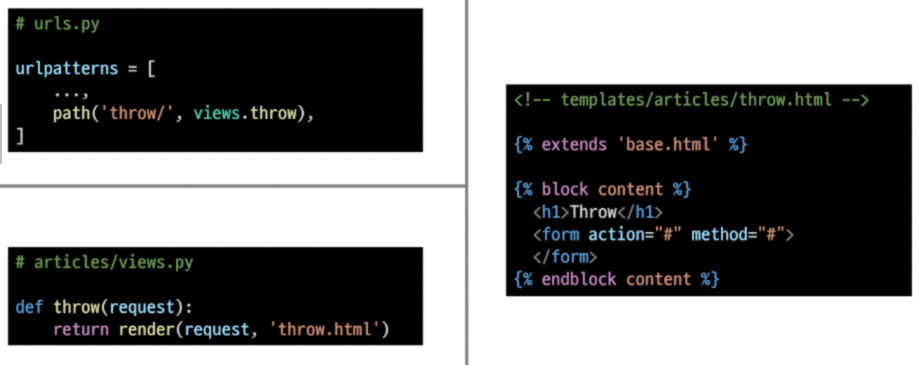
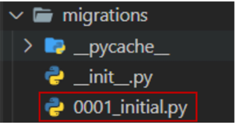

# 0316

## Form & Data

### Sending and Retrieving form data

- "데이터를 보내고 가져오기"

- HTML form element 를 통해 사용자와 애플리케이션 간의 상호작용 이해하기

### Client & Server architecture

- 웹은 다음과 같이 가장 기본적으로 클라이언트-서버 아키텍처를 사용
  
  - 클라이언트(일반적으로 웹브라우저)가 서버에 요청을 보내고, 서버는 클라이언트의 요청에 응답

- 클라이언트 측에서 HTML form은 HTTP 요청을 서버에 보내는 가장 편리한 방법

- 이를 통해 사용자는 HTTP 요청에서 전달할 정보를 제공할 수 있음

## Sending form data(Client)

### HTML <form> element

- 데이터가 전송되는 방법을 정희

- 웹에서 사용자 정보를 입력하는 여러 방식(text, button, submin 등)을 제공하고, 사용자로부터 할당된 데이터를 서버로 전송하는 역할을 담당

- "데이터를 어디(action)로 어떤 방식(method)으로 보낼지"

- 핵심 속성 
  
  - action
  
  - method

### HTML form's attributes

1. action
- 입력 데이터가 전송될 URL을 지정

- <u>데이터를 어디로 보낼 것</u>인지 지정하는 것이며 이 값은 반드시 유효한 URL이어야 함

- ~~만약 이 속성을 지정하지 않으면 데이터는 현재 form이 있는 페이지의 URL로 보내짐~~
2. method
- <u>데이터를 어떻게 보낼 것</u>인지 정의

- 입력데이터의 HTTP request methods를 지정

- HTML form 데이터는 오직 2가지 방법으로만 전송할 수 있는데 바로 GET 방식과 POST 방식

### HTML <form> element 작성

### HTML <input> element

- 사용자로부터 데이터를 입력 받기 위해 사용

- "type" 속성에 따라 동작 방식이 달라진다.
  
  - input 요소의 동작 방식은 type 특성에 따라 현격히 달라지므로 각각의 type은 별도로 MDN 문서에서 참고하여 사용하도록 함
  
  - type을 지정하지 않은 경우, 기본값 "text"

- 핵심 속성
  
  - name

### HTML input's attribute

- name
  
  - form을 통해 데이터를 제출(submint)했을 때 name 속성에 설정된 값을 서버로 전송하고, 서버는 name 속성에 설정된 값을 통해 사용자가 입력한 데이터 값에 접근할 수 있음
  
  - 서버에 전달하는 파라미터(name은 key, value는 value)로 매핑하는 것

### HTTP request methods

- HTTP
  
  - <u>HTML 문서와 같은 시소스(데이터, 자원)들을 가져올 수 있도록 해주는 프로토콜(규칙, 규악)</u>
  
  - 웹에서 이루어지는 모든 데이터 교환의 기초
  
  - HTTP는 주어진 리소스가 수행 할 원하는 작업을 나타내는 request methods를 정의

- 자원에 대한 행위(수행하고자 하는 동작)을 정의

- 주어진 리소스(자원)에 수행하길 원하는 행동을 나타냄

- HTTP Method 예시
  
  - <mark>GET</mark>, POST, PUT, DELETE

- GET이 아닌 다른 method는 추후 다시 알아볼 예정

### GET

- 서버로부터 정보를 조회하는 데 사용
  
  - 즉, 서버에게 리소스를 요청하기 위해 사용

- 데이터를 가져올 때만 사용해야 함

- <mark>데이터를 서버로 전송할 때 <u>Query String Parameters</u>를 통해 전송</mark>
  
  - 데이터는 URL 에 포함되어 서버로 보내짐

### GET 메서드 작성

- GET과 get 모두 대소문자 관계없이 동일 동작, 하지만 대문사 사용 권장

- 데이터 입력 후 submin 버튼을 누르고 URL의 변화를 확인한다

- http://127.0.0.1:8000/articles/throw/ => http://127.0.0.1:8000/articles/throw/?message=pizza#

        

### Query String Parameters

- 사용자가 입력 데이터를 전달하는 방법 중 하나로, url 주소에 데이터를 파라미터를 통해 넘기는 것

- 이러한 문자열은 & 로 연결된 key=value 쌍으로 구성되며 기본 URL과 물음표로 구분됨

- 예시
  
  

- Query String이라고 함

- 정해진 주소 이후에 물음표를 쓰는 것으로 Query String이 시작함을 알림

- "key=value"로 필요한 파라미터의 값을 적음
  
  - "="로 key와 value가 구분됨

- 파라미터가 여러 개인 경우 & 를 붙여 여러 개의 파라미터를 넘길 수 있음

## Retrieving the data(Server)

### Retrieving the data(Server)

- "데이터 가져오기(검색하기)"

- 서버는 클라이언트로 받은 key-value 쌍의 목록과 같은 데이터를 받게 됨

- 이러한 목록에 접근하는 방법은 사용하는 특정 프레임워크에 따라 다름

- 우리는 Django 프레임워크에서 어떻게 데이터를 가져올 수 있을지 알아볼 것
  
  - throw가 보낸 데이터를 catch 에서 가져오기

### catch 작성

        

### 데이터 가져오기

- catch 페이지가 잘 응답되어 출력됨을 확인

- 그런데 throw 페이지의 form이 보낸 데이터는 어디에 들어 있는걸까?
  
  - catch 페이지의 url확인 
  
  - GET method로 보내고 있기 때문에 데이터를 서버로 전송할 때 Query String Parameters를 통해 전송
  
  - 즉, 데이터는 URL에 포함되어 서버로 보내짐

- 그러면 우리가 작성해야 하는 view 함수에서는 해당 데이터에 어떻게 접근 가능할까

- "모든 요청 데이터는 view 함수의 첫번째 인가 request에 들어있다"

- request가 어떤 객체인지 확인해보기

### request 객체

### catch 작성 마무리

### Request and Response objects

- 요청과 응답 객체 흐름
1. 페이지가 요청되면 Django는 요청에 대한 메타데이터를 포함하는 HttpRequest object를 생성

2. 그리고 해당하는 적절한 view 함수를 로그하고 HttpRequest를 첫번째 인자로 전달

3. 마지막으로 view 함수는 HttpResponse object를 반환

## Django Model

### 개요

- Model(모델)의 핵심 개념과 ORM을 통한 데이터베이스 조작 이해

- Django는 웹 애플리케이션의 데이터를 구조화하고 조작하기 위한 추상적인 계층(모델)을 제공

## Database

### Database

- 체계화된 데이터의 모임

- 검색 및 구조화 같은 작업을 보다 쉽게 하기 위해 조직화된 데이터를 수집하는 저장 시스템

- Database의 가장 기초적인 키워드에 대해 알아보고 자세한 내용은 추후 Database 시간에 다룰 예정

### Database 기본 구조

1. 스키마 (Schema)

2. 테이블(Table)

### 스키마(Schema)

- 뼈대 (Structure)

- 데이터베이스에서 자료의 구조, 표현 방법, 관계 등을 정의한 구조

- 예시

        

### PK(Primary Key)

- 기본 키

- 각 레코드의 고유한 값(식별자로 사용)

- 기술적으로 다른 항목과 절대로 중복될 수 없는 단일 값(unique)

- 데이터베이스 관리 및 테이블 간 관계 설정 시 주요하게 활용 됨

### 쿼리(Query)

- 데이터를 조회하기 위한 명령어

- 조건에 맞는 데이터를 추출하거나 조작하는 명령어(주로 테이블형 자료 구조)

- Query를 날린다 : 데이터베이스를 조작한다

## Model

### 개요

- Django 는 Model을 통해 데이터에 접근하고 조작

- 사용하는 데이터들의 필수적인 필드들과 동작들을 포함

- 저장된 데이터베이스의 구조(layout)

- 일반적으로 각각의 모델은 하나의 데이터베이스 테이블에 매핑(mapping)
  
  - 모델 클래스 1개 == 데이터베이스 테이블 1개

- Model을 통해 데이터 관리

        

### Model 작성하기

- 새 프로젝터(crud), 앱(articles) 작성 및 앱 등록

        

- modles.py 작성
  
  - 모델 클래스를 작성하는 것은 데이터베이스 테이블의 스키마를 정의하는 것
  
  - "모델 클래스 == 테이블 스키마"
  
          

### Django Model Field

- Django는 모델 필드를 통해 테이블의 필드(컬럼)에 저장할 데이터 유형 (INT, TEXT 등)을 정의

- 데이터 유형에 따라 다양한 모델 필드 제공
  
  - DateField() (Data 아님 오타임),  CharField(), IntegerField() 등

### 데이터베이스 스키마

- 지금까지 작성한 models.py는 데이터베이스 스키마를 정의한 것

- 이제 이러한 모델의 변경사항을 실제 데이터베이스에 반영하기 위한 과정이 필요

### Migrations

### 개요

: Django가 모델에 생긴 변화(필드 추가, 수정 등) 실제 DB에 반영하는 방법

### Migrations 관련 주요 명령어

1. makemigrations

2. migrate

### makemigrations

- 모델의 변경사항에 대한 새로운 migration을 만들 때 사용

    

- 명령어 실행 후 migrations/0001_initial.py가 생성된 것을 확인

- "파이썬으로 작성된 설계도"

        

### migrate

- makemigrations로 만든 설계도를 실제 데이터베이스에 반영하는 과정

- 결과적으로 모델의 변경사항과 데이터베이스를 동기화

        

- 설계도(migration)를 실제 db.sqlite3 DB 파일에 반영

        

### 반드시 기억해야할 migrationg 3단계

1. models.py에서 변경사항이 발생하면

2. migration 생성 : makemigrations

3. DB 반영(모델과 DB의 동기화) : migrate

### 그런데 설계도는 어떻게, 누가 해석할까

- makemigrations로 인해 만들어진 설계도는 파이썬으로 작성되어 있음
- 그런데 SQL만 알아 들을 수 있다는 DB가 어떻게 이 설계도를 이해하고 동기화를 이룰 수 있을까?
- 바로 이 과정에서 중간에 번역을 담당하는 것이 ORM

## ORM

### 개요

- Object - Relational - Mapping

- 객체 지향 프로그래밍 언어를 사용하여 호환되지 않는 유형의 시스템 간에 (Django <-> DB) 데이터를 변환하는 프로그래밍 기술

- 객체 지향 프로그래밍에서 데이터베이스를 연동할 때, 데이터베이스와 객체 지향 프로그래밍 언어 간의 호환되지않는 데이터를 변환하는 프로그래밍 기법

- DJango는 내장 Django ORM을 사용

- 한 마디로 SQL을 사용하지 않고 데이터베이스를 조작할 수 있는 만들어주는 매개체

### ORM 장단점

- 장점
  
  - SQL을 잘 알지 못해도 객체지향 언어를 DB 조작이 가능
  
  - 객체 지향적 접근으로 인한 높은 생산성

- 
