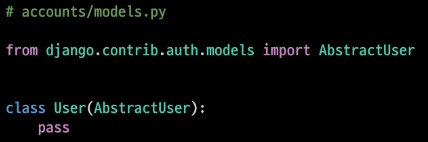
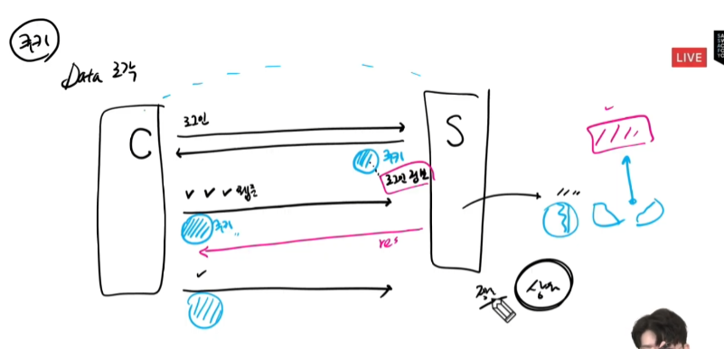
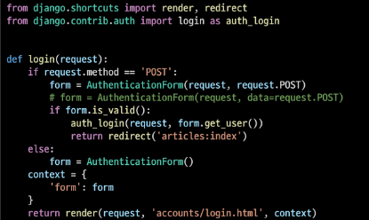
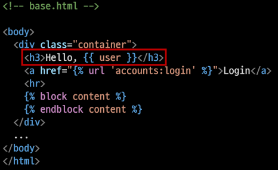
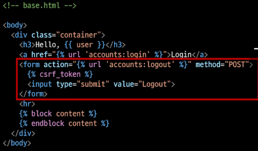

0322

## 인증과 권한

## The Django authentication system

### 개요

- Django authentication system(인증 시스템)은 인증(Authention)과 권한(Authorization)부여를 함께 제공(처리)하며, 이러한 기능을 일반적으로 인증 시스템이라고 함

- 필수 구성은 settings.py에 이미 포함 되어 있으며 INSTALLED_APPS에서 확인 가능
  
  - django.contrib.auth

- Authentication(인증)
  
  - 신원 확인(로그인)
  
  - 사용자가 자신이 누구인지 확인하는 것

- Authorization(권한, 허가)
  
  - 권한 부여
  
  - 인증된 사용자가 수행할 수 있는 작업을 결정

### 사전 설정

- migrate 

- 두번째 app accounts 생성 및 등록

- url 분리 및 매핑

## Custom User model

### 개요

- "Custom User Model로 대체하기"

- 기본 User Model을 필수적으로 Custom User model로 대체하는 이유 이해하기

- Django는 기본적인 인증 시스템과 여러가지 필드가 포함된 User Model 을 제공, 대부분의 개발 환경에서 기본 User Model을 Custom User Model로 대체함

- 개발자들이 작성하는 일부 프로젝트에서는 django에서 제공하는 built-in User model의 기본 인증 요구사항이 적절하지 않을 수 있음

- <u>Django는 현재 프로젝트에서 사용할 User Model을 결정하는 AUTH_USER_MODEL설정 값으로 Default User Model을 재정의(override)할 수 있도록 함</u>

### AUTH_USER_MODEL

- 프로젝트에서 User를 나타낼 때 사용하는 모델

- 프로젝트가 진행되는 동안 (모델을만들고 마이그레이션 한 후 )변경할 수 없음

- 프로젝트 시작 시 설정하기 위한 것, 참조하는 모델은 첫번째 마이그레이션에서 사용할 수 있어야 함
  
  - 즉, 첫번째 마이그레이션 전에 확정 지어야 하는 값

-  : 기본 값

### 주의!! 프로젝트 중간에 AUTH_USER_MODEL 변경하기

- 모델 관계에 영향을 미치기 때문에 훨씬 더 어려운 작업이 필요
  
  - 예를 들면 변경사항이 자동으로 수행될 수 없기 때문에 DB 스키마를 직접 수정하고, 이전 사용자 테이블에서 데이터를 이동하고, 일부 마이그레이션을 수동으로 다시 적용해야 하는 등 ,,, 

- 결론 : 중간 변경 권장하지 않음(프로젝트 처음에 진행하기)

여기까지! user라는 구조 변경 하지말자

### 데이터베이스 초기화

- 수업 진행을 위한 데이터베이스 초기화 후 마이그레이션 (프로젝트 중간일 경우)
1. migrations 파일 삭제

2. db.sqlite3 삭제

3. migrations 진행

## HTTP

### HTTP

- Hyper Text Transfer Protocpl

- HTML 문서와 같은 리소스들을 가져올 수 있도록 해주는 프로토콜

- 웹(WWW)에서 이루어지는 모든 데이터 교환의 기초

- 클라이언트 - 서버 프로토콜이라고도 부름

## 쿠키(Cookie)

### 개요

- HTTP 쿠키는 상태가 있는 세션을 만들도록 해 줌

### 개념

HTTP의 특징을 보완해주는 것, 정말 작은 data 조각 

### 쿠키 사용 목적

1. 세션 관리 : 로그인, 아이디 자동완성, 공지 하루 안보기 ,,, 

2. 개인화 : 사용자 선호, 테마 등의 설정

3. 트래킹 : 사용자 행동을 기록 및 분석

### 세션(Session)

- 사이트와 특정 브라우저 사이의 "state"를 유지시키는 것

- 클라이언트가 서버에 접속하면 서버가 특정 session id를 발급하고, 클라이언트는 session id를 쿠키에 저장
  
  - 클라이언트가 다시 동일한 서버에 접속하면 요청과 함께 쿠키를 서버에 전달
  
  - 쿠키는 요청 때마다 서버에 함께 전송되므로 서버에서 session id를 확인해 알맞은 로직을 처리

- session id는 세션을 구별하기 위해 필요하며, 쿠키에는 session id만 저장

### 쿠키 lifetime

1. Session cookie : 현재 세션(current session)이 종료되면 삭제됨, 브라우저 종료와 함께 세션 삭제

2. Persistent cookies : Expires 속성에 지정된 날짜 혹은 Max-Age 속성에 지정된 기간이 지나면 삭제됨

## Authentication in Web requests

## Login

### 개요

: 로그인은 Session을 Create하는 과정

### AuthenticationForm

- 로그인을 위한 built-in form
  
  - 로그인 하고자 하는 사용자 정보를 입력 받음
  
  - 기본적으로 username과 password를 받아 데이터가 유효한지 검증

- request를 첫번째 인자로 취함

### 로그인 페이지 작성

### login()

- login(request, user, backed=None)

- 인증된 사용자를 로그인 시키는 로직으로 view 함수에서 사용됨

- 현재 세션에 연결하려는 인증 된 사용자가 있는 경우 사용

- HttpRequest 객체와 User 객체가 필요

### logout

### logout()

- logout(request)

- HttpRequest 객체를 인자로 받고 반환 값이 없음

- 사용자가 로그인하지 않은 경우 오류를 발생시키지 않음

- 다음 2가지 일을 처리 한다.
1. 현재 요청에 대한 session data를 DB에서 삭제

2. 클라이언트의 쿠키에서도 sessionid를 삭제
-   이는 다른 사람이 동일한 웹 브라우저를 사용하고 로그인하고, 이전 사용자의 세션 데이터에 액세서를 하는 것을 방지하기 위함

