## 인증과 권한

HTTP의 특징

1. 비 연결 지향

2. 무상태

서버-클라이언트간 '상태'를 유지하기 위한 기술?

1. 쿠키

2. 세션

로그인?

사용자에 대한 세션을 생성하는 것

로그아웃?

세션을 클라이언트와 서버에서 삭제하는 것

## Authentication with User

### 개요

- User Object 와 User CRUD에 대한 이해
  
  - 회원 가입, 회원탈퇴, 회원정보 수정 ,비밀번호 변경

## 회원 가입

### 개요

- 회원 가입은 User을 Create하는 것이며 UserCreationForm built-in form을 사용

- 3개의 필드를 가짐
  
  1. username (from the user model)
  
  2. password1
  
  3. password2

### 회원 가입 페이지 작성

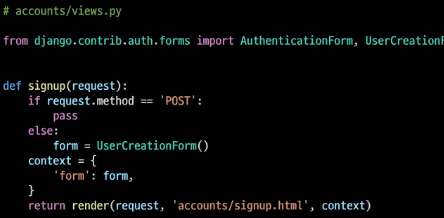

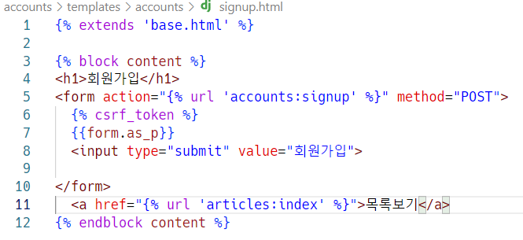

### 회원가입 로직 작성

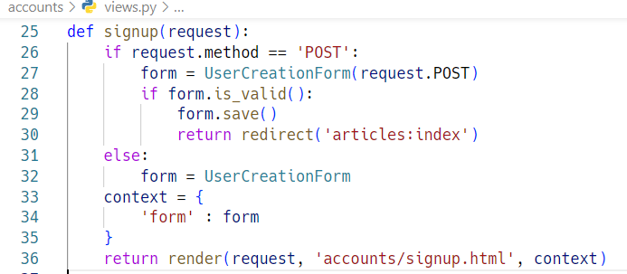

## Custom user & Built-in auth forms

### 개요

- Custom user 와 기존 Built-in auth forms 간의 관계

- Custom user로 인한 Built-in auth forms 변경

### AbstractBaseUser의 모든 subclass와 호환되는 forms

- 아래 From 클래스 User 모델을 대체하더라도 커스텀하지 않아도 사용 가능
  
  1. AuthenticationForm
  
  2. SetPasswordForm
  
  3. PasswordChangeForm
  
  4. AdminPAsswordChangeForm

- 기존 User 모델을 참조하는 Form이 아니기 때문

### 커스텀 유저 모델을 사용하려면 다시 작성하거나 확장해야 하는 forms

1. UserCreationForm

2. UserChangeForm
- 두 form 모두 class Meta: model = User 가 등록된 form이기 때문에 반드시 커스텀(확장)해야 함

### UserCreationForm() 커스텀 하기

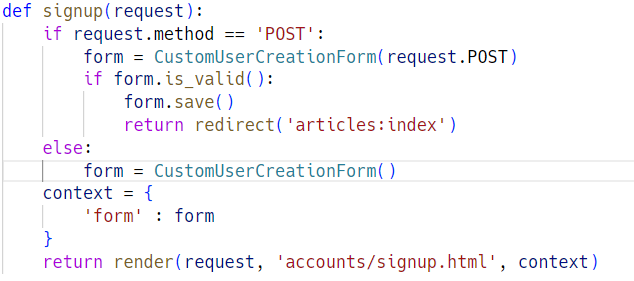

### 회원탈퇴

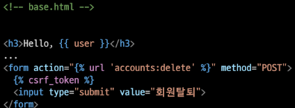

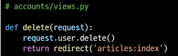

## 회원정보 수정

### 개요

- 회원정보 수정은 User를 Update 하는 것이며 UserChangeForm built-in form을 사용

### 회원정보 수정페이지 작성

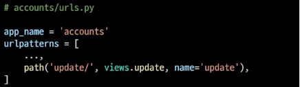

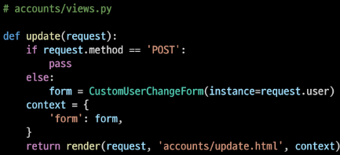

### 재정의 (수정 권한이 넘많앙 ,, 세개만 수정하게해줌)

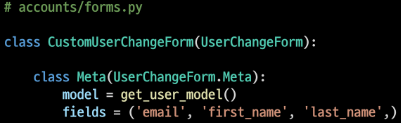

## 비밀번호 변경

### 비밀번호 변경

- 사용자가 비밀번호를 변경할 수 있도록 하는 Form

- 이전 비밀번호를 입력하여 비밀번호를 변경할 수 있도록 함

- 이전 비밀번호를 입력하지 않고 비밀번호를 설정할 수 있는 SetPasswordForm을 상속받는 서브 클래스

### 비밀번호 변경 페이지 작성

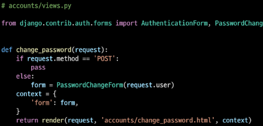

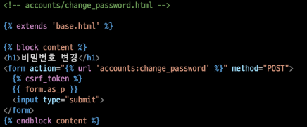

----------------뀨-----------------------
