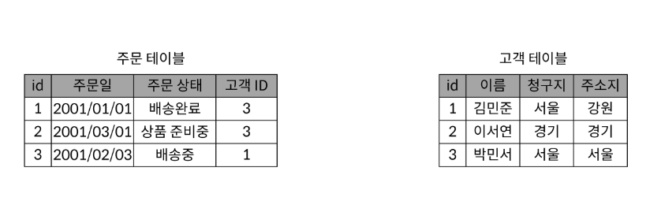
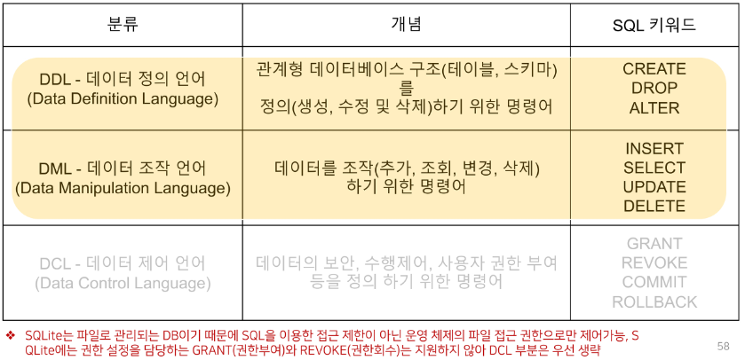
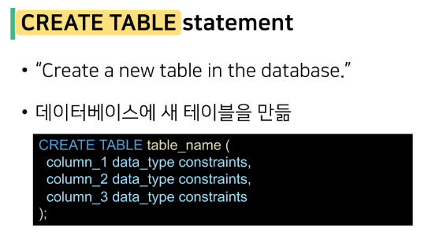
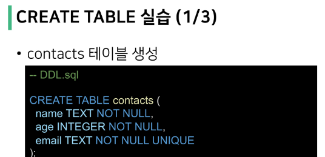

## 데이터의 시대

: 저장이나 처리에 효율적인 형태로 변환된 정보

### 무한하게 증가하는 데이터

- 매일 초당 2억개의 메일 전송되며 3만명이 넷플릭스를 시청

- 배달의 민족 ,,, 

### 파일을 이용한 데이터 관리

- 파일을 이용한 데이터 관리
  
  - 우리는 일반적으로 데이터를 파일에 저장
  
  - 장점 
    
    - 운영체제에 관계 없이 어디에서나 쉽게 사용가능
    
    - 이메일이나 메신저를 이용해 간편하게 전송 가능
  
  - 단점
    
    - 성능과 보안적 측면에서 한계가 명확
    
    - 대용량 데이터를 다루기에 적합하지 않음
    
    - 데이터를 구조적으로 정리하기에 어려움
    
    - 확장이 불가능한 구조

### 표(스프레드 시트)를 이용한 데이터 관리

- 스프레드 시트(엑셀 시트)를 이용

- 스프레드 시트는 컬럼(열)을 통해 데이터의 유형을 지정하고 레코드(행)을 통해 구체적인 데이터 값을 포함

- 무한하게 커질 수 없음 (100만 행 정도가 최대)

- 데이터 보안 측면

- 데이터 무결성 측면

## 데이터 베이스

: DBMS

### 데이터베이스의 종류

:SQL(관계형 데이터 베이스) vs NoSQL(비관계형 데이터베이스)

### 관계형 데이터베이스

Relational Database 

- 확장이 쉽지않음

### 비관계형 데이터베이스

NoSQL Database

- 메인으로 관계형, 서브로 비관계형

### 데이터베이스 시작하기

데이터가 무엇인지, 데이터베이스를 왜 써야 하는지, DBMS가 무엇인지, 데이터베이스 종류는 어떤 것들이 있는지

- 데이터 베이스를 조작하는언어 : SQL

## 관계형데이터 베이스

### 들어가기 전에

- 데이터베이스의 모든 것을 배우겠다?

- 우리가 사용하는 서비슨느 결국 데이터베이스를 사용한 CRUD의 반복
  
  - 회원가입, 탈퇴, 프로필 조회, 수정, 새로운피드 작성, 좋아요, 팔로우

### 관계형 데이터베이스(RDB)

- 데이터를 테이블, 형, 열 등으로나누어 구조화 하는 방식

- 구조화해서 저장하므로 보다 체계적으로 데이터를 저장하고 관리할 수 있음

- 자료를 여러 테이블로 나누어서 관리하고, 테이블간 관계를 설정해 여러 데이터를 조작할 수 있음

- 데이터의 무결성(정확성, 일관성) 유지에 장점이 있음

- SQL을 사용하여 데이터를 조회하고 조작

### 관계형 데이터베이스의 구조

1. 스키마

2. 테이블
- 필드

- 레코드

- 기본키

### 스키마(Schema) : 청사진(도면같은거인듯)

- 테이블의 구조(Structure)

- 데이터베이스에서 자료의 구조, 표현 방법, 관계 등 전반적인 명세를 기술한 것

### 테이블(Table)

- 필드와 레코드를 사용해 조직된 데이터 요소들의 집합

- 관계(Relation)라고도 부름
1. 필드(field) : 속성, 컬럼(Column)

2. 레코드(record) : 튜플 ,행(Row)

### 필드(Field)

- 속성 혹은 컬럼(column)

- 각 필드에는 고유

### 레코드

### PK(Primary key)

- 기본키

- <mark>각 레코드의 고유한 값</mark>
  
  - <mark>각각의 데이터를 구분할 수 있는 고윳값</mark>

- 기술적으로 다른 항목과 절대로 중복될 수 없는 단일 값(unique)

- 데이터베이스 관리 및 테이블 간<mark> 관계 설정시 주요하게 활용</mark>

### FK(Foreign Key)

- 왜래 키

- 한 테이블의 속성 중 다른 테이블의 레코드를 식별할 수 있는 키(==pk)

- 다른 테이블의 기본 키를 참조

- 참조하는 테이블의 속성 1개의 값은, 참조되는 측 테이블의 레코드 값에 대응

- 각 레코드에서 서로 다른 테이블 간의 관계를 만드는데 사용할 수 있음

### DBMS

: 데이터베이스를 쉽게 조작할 수 있게 해주는 소프트웨어

## SQL

SQL : 관계형 데이터베이스에서 데이터를 관리하기 위해 사용하는 언어

== 데이터베이스 관리 + CRUD  하는 언어

## SQL Commands

### SQL Commands 종류

- 명령어는 특성에 따라 다음 세 가지 그룹으로 분류
1. DDL

2. DML

3. DCL

## SQL Syntax

### SQL Syntax

- 모든 SQL 문(statement)는 SELECT, INSERT, UPDATE 등과 같은 키워드로 시작하고, 하나의 statement는 세미콜론(;)으로 끝남
  
  - 세미콜론은 각 SQL 문을 구분하는 표준 방법

- SQL 키워드는 대소문자를 구분하지 않음
  
  - 즉, SELECT와 select는 SQL 문에서 동일한 의미
  
  - 하지만 대문자로 작성하는 것을 권장

## DDL

## CREATE TABLE

## SQLite Data Types

### Data Types 종류

1. NULL
- NULL value

- 정보가없거나 알 수 없음을의미(missing information or unknown)
2. INTEGER
- 정수

- 크기에 따라 0,1,2,3,4,6 또는 8바이트와 같은 가변 크기를 가짐
3. REAL : 실수, 8바이트 부동 소수점을 사용하는 10진수 값이 있는 실수

4. TEXT : 문자 데이터

5. BLOB
- 입력된 그대로 저장된 데이터 덩어리(대용 타입 없음)

- 바이너리 등 멀티미디어 파일

- 예시 : 이미지 데이터

## Constraints

### 개요

- "제약조건"

- 입력하는 자료에 대해 제약을 정함

- 제약에 맞지 않다면 입력이 거부됨

- 사용자가 원하는 조건의 데이터만 유지하기 위한 즉, 데이터의 무결성을 유지하기 위한 보편적인 방법으로 테이블의 특정 컬럼에 설정하는 제약

### 종류

### rowid의 특징(==id)

- 테이블을 생성할 때마다 rowid라는 암시적 자동 증가 컬럼이 자동으로 생성됨

- 테이블의 행을 고유하게 식별하는 64비트 부호 있는 정수 값

## DDL 정리

