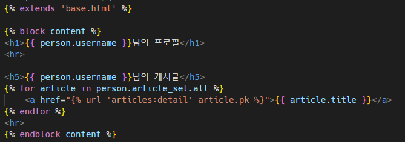
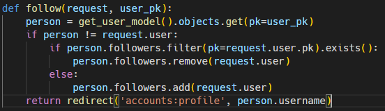

## M:N

### 개요

- User 자기 자신과의 M:N 관계 설정을 통한 팔로우 기능 구현하기

## Profile

### 개요

- 자연스러운 follw 흐름을 위한 프로필 페이지를 먼저 작성

### Profile 구현





- user.username / article.user.username 구분하기!! 


### Follow

### 모델 관계 설정


### Follow 구현





## Fixtures

### 개요

- Fixtures를 사용해 모델에 초기 데이터 제공하는 방법

### 초기 데이터의 필요성

- 협업하는 A,B 유저가 있다고 생각해보자
  
  1. A가 먼저 프로젝트를 작업 후 github에 push한다.
     
     - gitignore 설정으로 인해 DB는 업로드하지 않기 때문에 A가 개발하면서 사용한 데이터는 올라가지 않는다.
  
  2. B가 github에서 A push한 프로젝트를 pull / clone 한다.
     
     - 마찬가지로 프로젝트는 받았지만 A가 생성하고 조작한 데이터는 없는 빈 프로젝트를 받게 된다.

- 이처럼 Django 프로젝트의 앱을 처음 설정할 때 동일하게 준비 된 데이터로 데이터베이스를 미리 채우는 것이 필요한 순간이 있다.

- Django에서는 fixtures를 사용해 앱에 초기 데이터(initial data)를 제공할 수 있다.

- 즉, migrations와 fixtures를 사용하여 data와 구조를 공유하게 된다.

## Providing data with fixtures

### 사전준비

- M:N까지 모두 작성된 Django 프로젝트에서 유저, 게시글, 댓글, 좋아요 등 각 데이터 최소 2개 이상 생성해두기

### fixtures 생성 및 로드

- 생성(데이터 추출) : dumpdata

- 로드(데이터 입력) : loaddata

### dumpdata

- 응용프로그램과 관련된 데이터베이스의 모든 데이터를 표준 출력으로 출력함

- 여러 모델의 하나의 json 파일로 만들 수 있음

- articles app의 article 모델에 대한 data를 json 형식으로 저장하기

```bash
$ python manage.py dumpdata --indent 4 articles.article > articles.json
```

- manage.py 와 동일한 위치에 data가 담긴 articles.json 파일이 생성됨

- dumpdata의 출력 결과물은 loaddata의 입력으로 사용됨

** fixtures 파일은 직접 만드는 것이아니라 dumpdata를 사용하여 생성

- 추가로 나머지 모델에 대한 데이터를 dump 한다.

```bash
$ python manage.py dumpdata --ident 4 articles.user > users.json
$ python manage.py dumpdata --ident 4 articles.comment > comments.json
```

### loaddata

- fixtures의 내용을 검색하여 데이터베이스로 로드

```bash
python manage.py loaddata data.json
```

- fixtures 기본 경로
  
  - app_name/fixtures/
  
  - Django는 설치된 모든 app의 디렉토리에서 fixtures 폴더 이후의 경로로 fixtures 파일을 찾음

- fixtures의 내용을 검색하여 데이터베이스로 로드


- db.splite3 파일 삭제 후 migrate 작업을 진행

- fixtures load 하기

```bash
$ python manage.py loaddata articles.json users.json comments.json
```

- load 후 데이터가 잘 입력 되었는지 확인하기

### fixtures 정리

- fixtures 파일은 직접 만드는 것이 아니라 dumpdata를 사용하여 생성하는 것!
