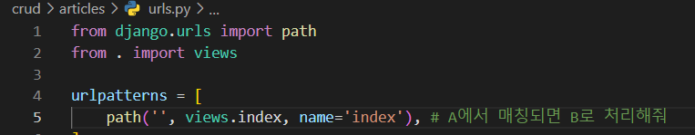
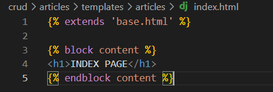
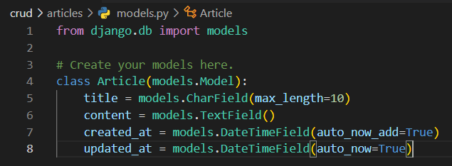
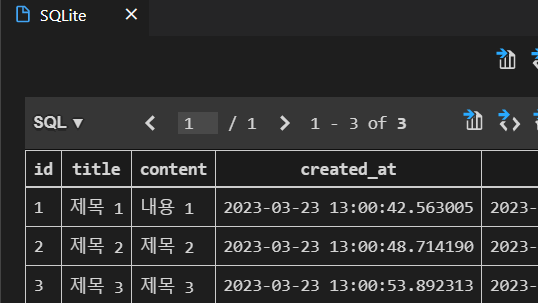
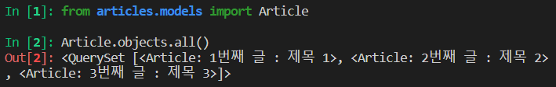
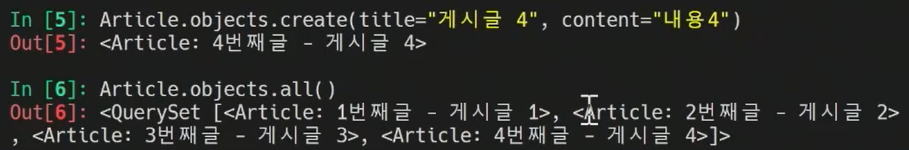
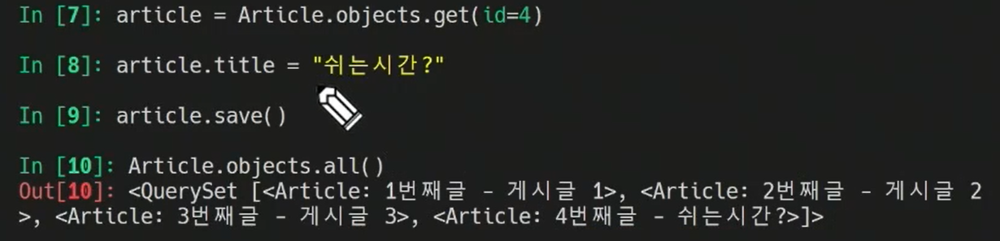
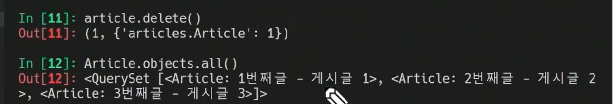
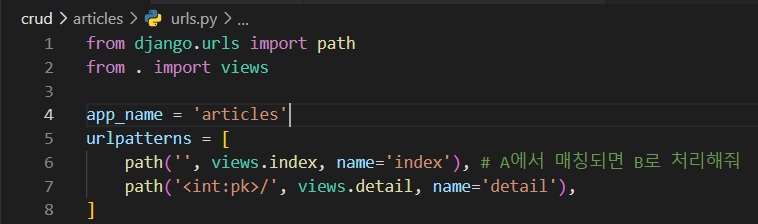
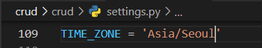

# CRUD

## 사전설정

startproject

startapp

base.html

### INDEX

pjt - url


app - urls






```bash
python manage.py migrate
```

## 데이터 모델링



```bash
python manage.py makemigrations
python manage.py migrate
```

## Admin site

```bash
python manage.py createsuperuser
```

주소 : ~~~/admin


로그인 후 화면

아까 만든 articles 도 화면에 보이게 하기


코드 수정 후



게시글 작성 후 database 열었을때


## python shell

: 장고의 기능 확인

```bash
python manage.py shell (install ipython)
```


내용을 받아왔지만 뭔지 잘 모르겠어 (articles models.py)




글 보기


글 생성



제목 바꾸기



글 삭제



### 전체 게시글 조회

#### index


### Detail




주소 : ~~~/ articles/<숫자>



#### 제목 누르면 상세페이지


## create


